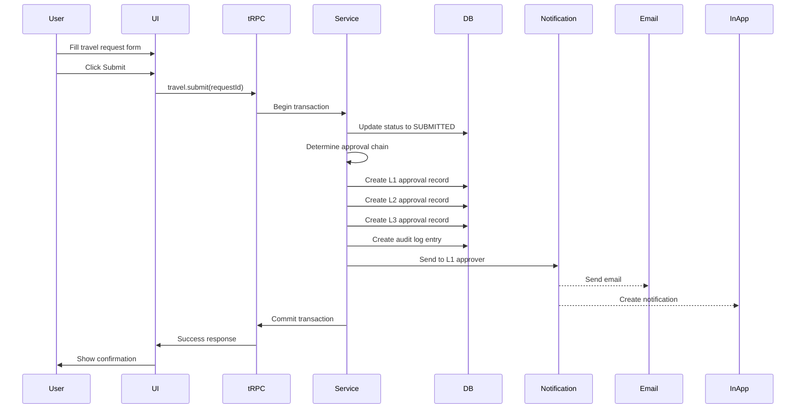
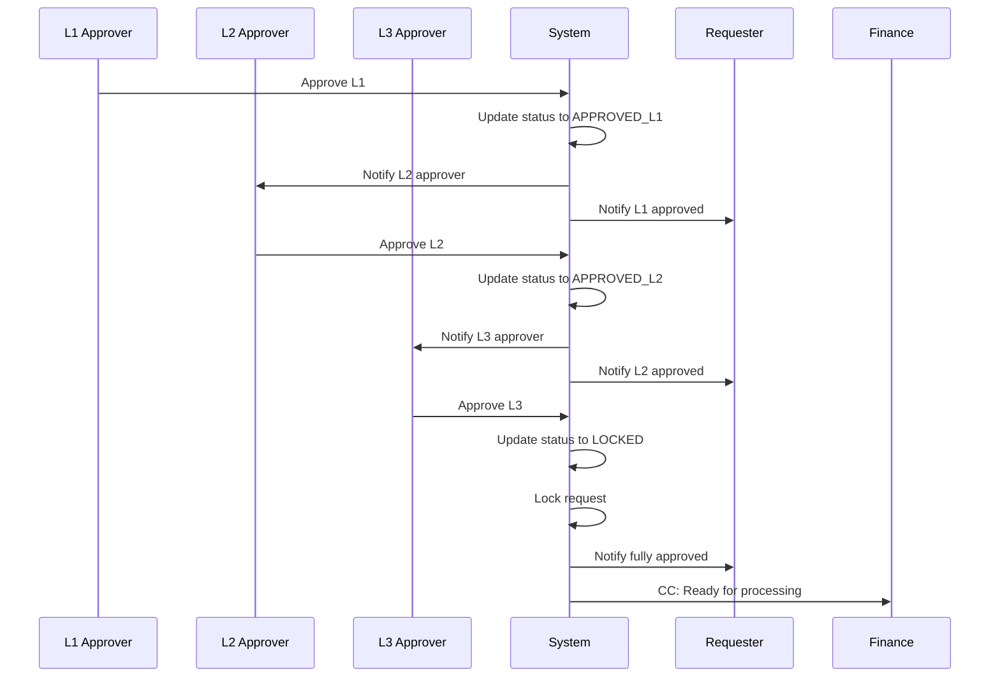
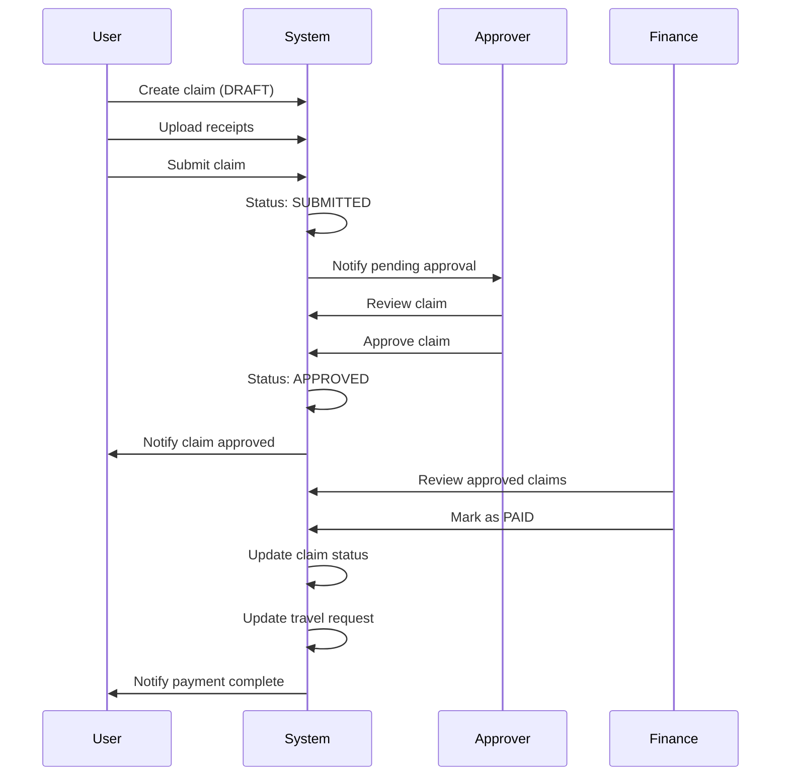

# Travel and Claim System - tRPC API Design

## Document Overview

**Project:** Travel and Claim Management System  
**Technology:** tRPC with Next.js, Prisma, TypeScript  
**Version:** 1.0  
**Last Updated:** 2026-02-06  
**Status:** Design Specification

**References:**
- Architecture: [`architecture.md`](architecture.md:1)
- Database Schema: [`travel-claim/prisma/schema.prisma`](travel-claim/prisma/schema.prisma:1)
- Authentication: [`AUTH_DESIGN.md`](AUTH_DESIGN.md:1)

---

## 1. tRPC Router Architecture

### 1.1 Router Organization

```
src/server/api/
├── root.ts                    # Root router combining all routers
├── trpc.ts                    # tRPC initialization and middleware
└── routers/
    ├── user.ts                # User management and profile
    ├── travel.ts              # Travel request operations
    ├── claim.ts               # Claims management
    ├── approval.ts            # Approval workflows
    ├── notification.ts        # Notification management
    ├── attachment.ts          # File upload and management
    ├── department.ts          # Department operations
    ├── admin.ts               # Administrative functions
    └── webhook.ts             # n8n webhook handlers
```

### 1.2 Router Structure Overview

```typescript
// Root router combining all routers
export const appRouter = router({
  user: userRouter,
  travel: travelRouter,
  claim: claimRouter,
  approval: approvalRouter,
  notification: notificationRouter,
  attachment: attachmentRouter,
  department: departmentRouter,
  admin: adminRouter,
  webhook: webhookRouter,
});

export type AppRouter = typeof appRouter;
```

### 1.3 Middleware Architecture

```typescript
// src/server/api/trpc.ts

// Base context for all procedures
export const createTRPCContext = async (opts: { headers: Headers }) => {
  const session = await auth();
  
  return {
    session,
    db: prisma,
    headers: opts.headers,
  };
};

// Middleware: Enforce authentication
const enforceUserIsAuthed = t.middleware(({ ctx, next }) => {
  if (!ctx.session?.user) {
    throw new TRPCError({ code: "UNAUTHORIZED" });
  }
  return next({
    ctx: {
      session: { ...ctx.session, user: ctx.session.user },
    },
  });
});

// Middleware: Enforce role requirements
const enforceRole = (allowedRoles: Role[]) => {
  return t.middleware(({ ctx, next }) => {
    if (!ctx.session?.user?.role) {
      throw new TRPCError({ code: "UNAUTHORIZED" });
    }
    if (!allowedRoles.includes(ctx.session.user.role)) {
      throw new TRPCError({ 
        code: "FORBIDDEN",
        message: "Insufficient permissions for this operation"
      });
    }
    return next({ ctx });
  });
};

// Public procedure (no auth required)
export const publicProcedure = t.procedure;

// Protected procedure (auth required)
export const protectedProcedure = t.procedure.use(enforceUserIsAuthed);

// Role-based procedures
export const supervisorProcedure = protectedProcedure
  .use(enforceRole(["SUPERVISOR", "MANAGER", "DIRECTOR", "ADMIN"]));

export const managerProcedure = protectedProcedure
  .use(enforceRole(["MANAGER", "DIRECTOR", "ADMIN"]));

export const directorProcedure = protectedProcedure
  .use(enforceRole(["DIRECTOR", "ADMIN"]));

export const financeProcedure = protectedProcedure
  .use(enforceRole(["FINANCE", "ADMIN"]));

export const adminProcedure = protectedProcedure
  .use(enforceRole(["ADMIN"]));
```

---

## 2. Complete Procedure Catalog

### 2.1 User Router

```typescript
// src/server/api/routers/user.ts

export const userRouter = router({
  
  // Get current user profile
  me: protectedProcedure
    .query(async ({ ctx }) => {
      return await ctx.db.user.findUnique({
        where: { id: ctx.session.user.id },
        include: {
          department: true,
          supervisor: { select: { id: true, name: true, email: true } },
          directReports: { select: { id: true, name: true, email: true } },
        },
      });
    }),
  
  // Update user profile
  updateProfile: protectedProcedure
    .input(z.object({
      name: z.string().min(1).max(100).optional(),
      phoneNumber: z.string().regex(/^\+?[1-9]\d{1,14}$/).optional(),
    }))
    .mutation(async ({ ctx, input }) => {
      return await ctx.db.user.update({
        where: { id: ctx.session.user.id },
        data: input,
      });
    }),
  
  // List employees (for assignment)
  list: protectedProcedure
    .input(z.object({
      departmentId: z.string().optional(),
      search: z.string().optional(),
      role: z.nativeEnum(Role).optional(),
      limit: z.number().min(1).max(100).default(50),
      cursor: z.string().optional(),
    }))
    .query(async ({ ctx, input }) => {
      const where: Prisma.UserWhereInput = {
        deletedAt: null,
        ...(input.departmentId && { departmentId: input.departmentId }),
        ...(input.role && { role: input.role }),
        ...(input.search && {
          OR: [
            { name: { contains: input.search, mode: 'insensitive' } },
            { email: { contains: input.search, mode: 'insensitive' } },
            { employeeId: { contains: input.search, mode: 'insensitive' } },
          ],
        }),
      };
      
      const users = await ctx.db.user.findMany({
        where,
        take: input.limit + 1,
        cursor: input.cursor ? { id: input.cursor } : undefined,
        orderBy: { name: 'asc' },
        select: {
          id: true,
          name: true,
          email: true,
          employeeId: true,
          role: true,
          department: { select: { name: true } },
        },
      });
      
      let nextCursor: string | undefined = undefined;
      if (users.length > input.limit) {
        const nextItem = users.pop();
        nextCursor = nextItem!.id;
      }
      
      return { users, nextCursor };
    }),
  
  // Get organizational hierarchy (manager chain)
  getManagerChain: protectedProcedure
    .input(z.object({ userId: z.string().optional() }))
    .query(async ({ ctx, input }) => {
      const userId = input.userId ?? ctx.session.user.id;
      const chain: Array<{ id: string; name: string; role: Role }> = [];
      
      let currentUser = await ctx.db.user.findUnique({
        where: { id: userId },
        select: { id: true, name: true, role: true, supervisorId: true },
      });
      
      while (currentUser?.supervisorId) {
        const supervisor = await ctx.db.user.findUnique({
          where: { id: currentUser.supervisorId },
          select: { id: true, name: true, role: true, supervisorId: true },
        });
        if (!supervisor) break;
        chain.push(supervisor);
        currentUser = supervisor;
      }
      
      return chain;
    }),
});
```

### 2.2 Travel Router

```typescript
// src/server/api/routers/travel.ts

export const travelRouter = router({
  
  // Create draft travel request
  create: protectedProcedure
    .input(z.object({
      purpose: z.string().min(10).max(1000),
      destination: z.string().min(1).max(255),
      travelType: z.nativeEnum(TravelType),
      startDate: z.date(),
      endDate: z.date(),
      estimatedBudget: z.number().positive().optional(),
      projectName: z.string().max(255).optional(),
      customerName: z.string().max(255).optional(),
      salesPerson: z.string().max(100).optional(),
      participantIds: z.array(z.string()).optional(),
    }))
    .mutation(async ({ ctx, input }) => {
      // Validation: endDate >= startDate
      if (input.endDate < input.startDate) {
        throw new TRPCError({
          code: "BAD_REQUEST",
          message: "End date must be on or after start date",
        });
      }
      
      const requestNumber = await generateRequestNumber();
      
      return await ctx.db.travelRequest.create({
        data: {
          requestNumber,
          requesterId: ctx.session.user.id,
          purpose: input.purpose,
          destination: input.destination,
          travelType: input.travelType,
          startDate: input.startDate,
          endDate: input.endDate,
          estimatedBudget: input.estimatedBudget,
          projectName: input.projectName,
          customerName: input.customerName,
          salesPerson: input.salesPerson,
          status: TravelStatus.DRAFT,
          participants: {
            create: input.participantIds?.map(userId => ({
              userId,
            })) ?? [],
          },
        },
        include: {
          participants: { include: { user: true } },
        },
      });
    }),
  
  // Update draft travel request
  update: protectedProcedure
    .input(z.object({
      id: z.string(),
      purpose: z.string().min(10).max(1000).optional(),
      destination: z.string().min(1).max(255).optional(),
      travelType: z.nativeEnum(TravelType).optional(),
      startDate: z.date().optional(),
      endDate: z.date().optional(),
      estimatedBudget: z.number().positive().optional(),
      projectName: z.string().max(255).optional(),
      customerName: z.string().max(255).optional(),
      salesPerson: z.string().max(100).optional(),
    }))
    .mutation(async ({ ctx, input }) => {
      const { id, ...data } = input;
      
      // Check ownership and status
      const existing = await ctx.db.travelRequest.findUnique({
        where: { id },
        select: { requesterId: true, status: true },
      });
      
      if (!existing) {
        throw new TRPCError({ code: "NOT_FOUND", message: "Travel request not found" });
      }
      
      if (existing.requesterId !== ctx.session.user.id) {
        throw new TRPCError({ code: "FORBIDDEN", message: "Not authorized to update this request" });
      }
      
      if (existing.status !== TravelStatus.DRAFT) {
        throw new TRPCError({
          code: "BAD_REQUEST",
          message: "Can only update draft requests",
        });
      }
      
      return await ctx.db.travelRequest.update({
        where: { id },
        data,
      });
    }),
  
  // Add/remove participants
  updateParticipants: protectedProcedure
    .input(z.object({
      id: z.string(),
      addUserIds: z.array(z.string()).optional(),
      removeUserIds: z.array(z.string()).optional(),
    }))
    .mutation(async ({ ctx, input }) => {
      // Check ownership and DRAFT status
      const request = await ctx.db.travelRequest.findUnique({
        where: { id: input.id },
        select: { requesterId: true, status: true },
      });
      
      if (!request || request.requesterId !== ctx.session.user.id) {
        throw new TRPCError({ code: "FORBIDDEN" });
      }
      
      if (request.status !== TravelStatus.DRAFT) {
        throw new TRPCError({
          code: "BAD_REQUEST",
          message: "Can only modify participants in draft status",
        });
      }
      
      await ctx.db.$transaction(async (tx) => {
        // Remove participants
        if (input.removeUserIds?.length) {
          await tx.travelParticipant.deleteMany({
            where: {
              travelRequestId: input.id,
              userId: { in: input.removeUserIds },
            },
          });
        }
        
        // Add participants
        if (input.addUserIds?.length) {
          await tx.travelParticipant.createMany({
            data: input.addUserIds.map(userId => ({
              travelRequestId: input.id,
              userId,
            })),
            skipDuplicates: true,
          });
        }
      });
      
      return { success: true };
    }),
  
  // Submit for approval
  submit: protectedProcedure
    .input(z.object({ id: z.string() }))
    .mutation(async ({ ctx, input }) => {
      const request = await ctx.db.travelRequest.findUnique({
        where: { id: input.id },
        include: { requester: { include: { department: true, supervisor: true } } },
      });
      
      if (!request || request.requesterId !== ctx.session.user.id) {
        throw new TRPCError({ code: "FORBIDDEN" });
      }
      
      if (request.status !== TravelStatus.DRAFT) {
        throw new TRPCError({
          code: "BAD_REQUEST",
          message: "Can only submit draft requests",
        });
      }
      
      // Determine approval chain
      const approvalChain = determineApprovalChain(
        request.requester.role,
        request.travelType,
        request.requester
      );
      
      return await ctx.db.$transaction(async (tx) => {
        // Update request status
        const updated = await tx.travelRequest.update({
          where: { id: input.id },
          data: {
            status: TravelStatus.SUBMITTED,
            submittedAt: new Date(),
          },
        });
        
        // Create approval records
        for (const approvalDef of approvalChain) {
          await tx.approval.create({
            data: {
              travelRequestId: input.id,
              level: approvalDef.level,
              approverId: approvalDef.approverId,
              status: ApprovalStatus.PENDING,
            },
          });
        }
        
        // Send notification to first approver
        await sendNotification(tx, {
          userId: approvalChain[0].approverId,
          title: "Travel Request Awaiting Approval",
          message: `Travel request #${request.requestNumber} from ${request.requester.name} requires your approval.`,
          channels: [NotificationChannel.EMAIL, NotificationChannel.IN_APP],
          entityType: "TravelRequest",
          entityId: input.id,
          actionUrl: `/approvals?requestId=${input.id}`,
        });
        
        // Audit log
        await tx.auditLog.create({
          data: {
            userId: ctx.session.user.id,
            action: AuditAction.SUBMIT,
            entityType: "TravelRequest",
            entityId: input.id,
          },
        });
        
        return updated;
      });
    }),
  
  // Delete draft request
  delete: protectedProcedure
    .input(z.object({ id: z.string() }))
    .mutation(async ({ ctx, input }) => {
      const request = await ctx.db.travelRequest.findUnique({
        where: { id: input.id },
        select: { requesterId: true, status: true },
      });
      
      if (!request || request.requesterId !== ctx.session.user.id) {
        throw new TRPCError({ code: "FORBIDDEN" });
      }
      
      if (request.status !== TravelStatus.DRAFT) {
        throw new TRPCError({
          code: "BAD_REQUEST",
          message: "Can only delete draft requests",
        });
      }
      
      await ctx.db.travelRequest.update({
        where: { id: input.id },
        data: { deletedAt: new Date() },
      });
      
      return { success: true };
    }),
  
  // List user's travel requests
  list: protectedProcedure
    .input(z.object({
      status: z.nativeEnum(TravelStatus).optional(),
      travelType: z.nativeEnum(TravelType).optional(),
      startDate: z.date().optional(),
      endDate: z.date().optional(),
      limit: z.number().min(1).max(100).default(20),
      cursor: z.string().optional(),
    }))
    .query(async ({ ctx, input }) => {
      const where: Prisma.TravelRequestWhereInput = {
        requesterId: ctx.session.user.id,
        deletedAt: null,
        ...(input.status && { status: input.status }),
        ...(input.travelType && { travelType: input.travelType }),
        ...(input.startDate && { startDate: { gte: input.startDate } }),
        ...(input.endDate && { endDate: { lte: input.endDate } }),
      };
      
      const requests = await ctx.db.travelRequest.findMany({
        where,
        take: input.limit + 1,
        cursor: input.cursor ? { id: input.cursor } : undefined,
        orderBy: { createdAt: 'desc' },
        include: {
          participants: { include: { user: { select: { name: true } } } },
          approvals: {
            where: { status: { not: ApprovalStatus.PENDING } },
            select: { level: true, status: true, approver: { select: { name: true } } },
          },
        },
      });
      
      let nextCursor: string | undefined = undefined;
      if (requests.length > input.limit) {
        const nextItem = requests.pop();
        nextCursor = nextItem!.id;
      }
      
      return { requests, nextCursor };
    }),
  
  // Get travel request details
  getById: protectedProcedure
    .input(z.object({ id: z.string() }))
    .query(async ({ ctx, input }) => {
      const request = await ctx.db.travelRequest.findUnique({
        where: { id: input.id },
        include: {
          requester: { select: { id: true, name: true, email: true, employeeId: true } },
          participants: { include: { user: { select: { name: true, email: true } } } },
          approvals: {
            include: { approver: { select: { name: true, role: true } } },
            orderBy: { level: 'asc' },
          },
          claims: { select: { id: true, claimNumber: true, amount: true, status: true } },
        },
      });
      
      if (!request) {
        throw new TRPCError({ code: "NOT_FOUND", message: "Travel request not found" });
      }
      
      // Check authorization: owner, participant, or approver
      const isOwner = request.requesterId === ctx.session.user.id;
      const isParticipant = request.participants.some(p => p.userId === ctx.session.user.id);
      const isApprover = request.approvals.some(a => a.approverId === ctx.session.user.id);
      const isAdmin = ctx.session.user.role === Role.ADMIN;
      
      if (!isOwner && !isParticipant && !isApprover && !isAdmin) {
        throw new TRPCError({ code: "FORBIDDEN" });
      }
      
      return request;
    }),
});
```

### 2.3 Approval Router

```typescript
// src/server/api/routers/approval.ts

export const approvalRouter = router({
  
  // Get pending approvals for current user
  getPending: protectedProcedure
    .input(z.object({
      limit: z.number().min(1).max(100).default(20),
      cursor: z.string().optional(),
    }))
    .query(async ({ ctx, input }) => {
      const approvals = await ctx.db.approval.findMany({
        where: {
          approverId: ctx.session.user.id,
          status: ApprovalStatus.PENDING,
        },
        take: input.limit + 1,
        cursor: input.cursor ? { id: input.cursor } : undefined,
        orderBy: { createdAt: 'asc' },
        include: {
          travelRequest: {
            select: {
              id: true,
              requestNumber: true,
              purpose: true,
              destination: true,
              startDate: true,
              endDate: true,
              requester: { select: { name: true, email: true } },
            },
          },
          claim: {
            select: {
              id: true,
              claimNumber: true,
              claimType: true,
              amount: true,
              submitter: { select: { name: true } },
            },
          },
        },
      });
      
      let nextCursor: string | undefined = undefined;
      if (approvals.length > input.limit) {
        const nextItem = approvals.pop();
        nextCursor = nextItem!.id;
      }
      
      return { approvals, nextCursor };
    }),
  
  // Approve travel request
  approve: supervisorProcedure
    .input(z.object({
      approvalId: z.string(),
      comments: z.string().max(1000).optional(),
    }))
    .mutation(async ({ ctx, input }) => {
      const approval = await ctx.db.approval.findUnique({
        where: { id: input.approvalId },
        include: {
          travelRequest: {
            include: {
              requester: true,
              approvals: { orderBy: { level: 'asc' } },
            },
          },
        },
      });
      
      if (!approval) {
        throw new TRPCError({ code: "NOT_FOUND", message: "Approval not found" });
      }
      
      if (approval.approverId !== ctx.session.user.id) {
        throw new TRPCError({ code: "FORBIDDEN", message: "Not authorized to approve" });
      }
      
      if (approval.status !== ApprovalStatus.PENDING) {
        throw new TRPCError({
          code: "BAD_REQUEST",
          message: "Approval already processed",
        });
      }
      
      // Check role authorization for approval level
      if (!canApproveLevel(ctx.session.user.role, approval.level)) {
        throw new TRPCError({
          code: "FORBIDDEN",
          message: "Insufficient role for this approval level",
        });
      }
      
      return await ctx.db.$transaction(async (tx) => {
        // Mark approval as approved
        await tx.approval.update({
          where: { id: input.approvalId },
          data: {
            status: ApprovalStatus.APPROVED,
            approvedAt: new Date(),
            comments: input.comments,
          },
        });
        
        // Determine next status
        const nextStatus = getNextTravelStatus(approval.level);
        const allApprovals = approval.travelRequest!.approvals;
        const isLastApproval = allApprovals.every(
          a => a.id === input.approvalId || a.status === ApprovalStatus.APPROVED
        );
        
        // Update travel request status
        await tx.travelRequest.update({
          where: { id: approval.travelRequestId! },
          data: {
            status: isLastApproval ? TravelStatus.LOCKED : nextStatus,
            ...(isLastApproval && { lockedAt: new Date() }),
          },
        });
        
        // Notify requester
        await sendNotification(tx, {
          userId: approval.travelRequest!.requesterId,
          title: "Travel Request Approved",
          message: `Your travel request #${approval.travelRequest!.requestNumber} has been approved by ${ctx.session.user.name}.`,
          channels: [NotificationChannel.EMAIL, NotificationChannel.IN_APP, NotificationChannel.WHATSAPP],
          entityType: "TravelRequest",
          entityId: approval.travelRequestId!,
        });
        
        // If not last approval, notify next approver
        if (!isLastApproval) {
          const nextApproval = allApprovals.find(
            a => a.status === ApprovalStatus.PENDING && a.level > approval.level
          );
          if (nextApproval) {
            await sendNotification(tx, {
              userId: nextApproval.approverId,
              title: "Travel Request Awaiting Approval",
              message: `Travel request #${approval.travelRequest!.requestNumber} requires your approval.`,
              channels: [NotificationChannel.EMAIL, NotificationChannel.IN_APP],
              entityType: "TravelRequest",
              entityId: approval.travelRequestId!,
            });
          }
        }
        
        // Audit log
        await tx.auditLog.create({
          data: {
            userId: ctx.session.user.id,
            action: AuditAction.APPROVE,
            entityType: "TravelRequest",
            entityId: approval.travelRequestId!,
          },
        });
        
        return { success: true };
      });
    }),
  
  // Reject travel request
  reject: supervisorProcedure
    .input(z.object({
      approvalId: z.string(),
      reason: z.string().min(10).max(1000),
    }))
    .mutation(async ({ ctx, input }) => {
      const approval = await ctx.db.approval.findUnique({
        where: { id: input.approvalId },
        include: { travelRequest: { include: { requester: true } } },
      });
      
      if (!approval || approval.approverId !== ctx.session.user.id) {
        throw new TRPCError({ code: "FORBIDDEN" });
      }
      
      if (approval.status !== ApprovalStatus.PENDING) {
        throw new TRPCError({
          code: "BAD_REQUEST",
          message: "Approval already processed",
        });
      }
      
      return await ctx.db.$transaction(async (tx) => {
        // Mark approval as rejected
        await tx.approval.update({
          where: { id: input.approvalId },
          data: {
            status: ApprovalStatus.REJECTED,
            rejectedAt: new Date(),
            rejectionReason: input.reason,
          },
        });
        
        // Update travel request to rejected
        await tx.travelRequest.update({
          where: { id: approval.travelRequestId! },
          data: { status: TravelStatus.REJECTED },
        });
        
        // Notify requester
        await sendNotification(tx, {
          userId: approval.travelRequest!.requesterId,
          title: "Travel Request Rejected",
          message: `Your travel request #${approval.travelRequest!.requestNumber} has been rejected. Reason: ${input.reason}`,
          channels: [NotificationChannel.EMAIL, NotificationChannel.IN_APP, NotificationChannel.WHATSAPP],
          entityType: "TravelRequest",
          entityId: approval.travelRequestId!,
        });
        
        // Audit log
        await tx.auditLog.create({
          data: {
            userId: ctx.session.user.id,
            action: AuditAction.REJECT,
            entityType: "TravelRequest",
            entityId: approval.travelRequestId!,
            metadata: { reason: input.reason },
          },
        });
        
        return { success: true };
      });
    }),
  
  // Request revision
  requestRevision: supervisorProcedure
    .input(z.object({
      approvalId: z.string(),
      feedback: z.string().min(10).max(1000),
    }))
    .mutation(async ({ ctx, input }) => {
      const approval = await ctx.db.approval.findUnique({
        where: { id: input.approvalId },
        include: { travelRequest: { include: { requester: true } } },
      });
      
      if (!approval || approval.approverId !== ctx.session.user.id) {
        throw new TRPCError({ code: "FORBIDDEN" });
      }
      
      return await ctx.db.$transaction(async (tx) => {
        await tx.approval.update({
          where: { id: input.approvalId },
          data: {
            status: ApprovalStatus.REVISION_REQUESTED,
            comments: input.feedback,
          },
        });
        
        await tx.travelRequest.update({
          where: { id: approval.travelRequestId! },
          data: { status: TravelStatus.REVISION },
        });
        
        await sendNotification(tx, {
          userId: approval.travelRequest!.requesterId,
          title: "Travel Request Needs Revision",
          message: `Your travel request requires revision. Feedback: ${input.feedback}`,
          channels: [NotificationChannel.EMAIL, NotificationChannel.IN_APP],
          entityType: "TravelRequest",
          entityId: approval.travelRequestId!,
        });
        
        return { success: true };
      });
    }),
  
  // Get approval history for a request
  getHistory: protectedProcedure
    .input(z.object({
      travelRequestId: z.string().optional(),
      claimId: z.string().optional(),
    }))
    .query(async ({ ctx, input }) => {
      if (!input.travelRequestId && !input.claimId) {
        throw new TRPCError({
          code: "BAD_REQUEST",
          message: "Either travelRequestId or claimId required",
        });
      }
      
      return await ctx.db.approval.findMany({
        where: {
          ...(input.travelRequestId && { travelRequestId: input.travelRequestId }),
          ...(input.claimId && { claimId: input.claimId }),
        },
        include: {
          approver: { select: { name: true, role: true, email: true } },
        },
        orderBy: { level: 'asc' },
      });
    }),
});
```

### 2.4 Claim Router

```typescript
// src/server/api/routers/claim.ts

export const claimRouter = router({
  
  // Create claim
  create: protectedProcedure
    .input(z.object({
      travelRequestId: z.string(),
      claimType: z.nativeEnum(ClaimType),
      
      // Entertainment fields
      entertainmentType: z.nativeEnum(EntertainmentType).optional(),
      entertainmentDate: z.date().optional(),
      entertainmentLocation: z.string().max(255).optional(),
      entertainmentAddress: z.string().optional(),
      guestName: z.string().max(255).optional(),
      guestCompany: z.string().max(255).optional(),
      guestPosition: z.string().max(100).optional(),
      isGovernmentOfficial: z.boolean().optional(),
      
      // Non-entertainment fields
      expenseCategory: z.nativeEnum(NonEntertainmentCategory).optional(),
      expenseDate: z.date().optional(),
      expenseDestination: z.string().max(255).optional(),
      customerName: z.string().max(255).optional(),
      
      // Common fields
      amount: z.number().positive().max(1000000),
      description: z.string().min(10).max(1000),
      notes: z.string().max(1000).optional(),
      submittedVia: z.string().optional(),
    }))
    .mutation(async ({ ctx, input }) => {
      // Validate travel request is approved/locked
      const travelRequest = await ctx.db.travelRequest.findUnique({
        where: { id: input.travelRequestId },
        select: { requesterId: true, status: true, participants: true },
      });
      
      if (!travelRequest) {
        throw new TRPCError({ code: "NOT_FOUND", message: "Travel request not found" });
      }
      
      // Check authorization: must be requester or participant
      const isRequester = travelRequest.requesterId === ctx.session.user.id;
      const isParticipant = travelRequest.participants.some(
        p => p.userId === ctx.session.user.id
      );
      
      if (!isRequester && !isParticipant) {
        throw new TRPCError({
          code: "FORBIDDEN",
          message: "Only travel participants can submit claims",
        });
      }
      
      if (![TravelStatus.LOCKED, TravelStatus.CLOSED].includes(travelRequest.status)) {
        throw new TRPCError({
          code: "BAD_REQUEST",
          message: "Can only submit claims for approved travel requests",
        });
      }
      
      // Validate required fields per claim type
      if (input.claimType === ClaimType.ENTERTAINMENT) {
        if (!input.entertainmentType || !input.entertainmentDate || !input.guestName) {
          throw new TRPCError({
            code: "BAD_REQUEST",
            message: "Entertainment claims require type, date, and guest information",
          });
        }
      } else {
        if (!input.expenseCategory || !input.expenseDate) {
          throw new TRPCError({
            code: "BAD_REQUEST",
            message: "Non-entertainment claims require category and date",
          });
        }
      }
      
      const claimNumber = await generateClaimNumber();
      
      return await ctx.db.claim.create({
        data: {
          claimNumber,
          travelRequestId: input.travelRequestId,
          submitterId: ctx.session.user.id,
          claimType: input.claimType,
          status: ClaimStatus.DRAFT,
          entertainmentType: input.entertainmentType,
          entertainmentDate: input.entertainmentDate,
          entertainmentLocation: input.entertainmentLocation,
          entertainmentAddress: input.entertainmentAddress,
          guestName: input.guestName,
          guestCompany: input.guestCompany,
          guestPosition: input.guestPosition,
          isGovernmentOfficial: input.isGovernmentOfficial,
          expenseCategory: input.expenseCategory,
          expenseDate: input.expenseDate,
          expenseDestination: input.expenseDestination,
          customerName: input.customerName,
          amount: input.amount,
          description: input.description,
          notes: input.notes,
          submittedVia: input.submittedVia ?? "web",
        },
      });
    }),
  
  // Update claim (draft only)
  update: protectedProcedure
    .input(z.object({
      id: z.string(),
      amount: z.number().positive().optional(),
      description: z.string().min(10).max(1000).optional(),
      notes: z.string().max(1000).optional(),
      // ... other updatable fields
    }))
    .mutation(async ({ ctx, input }) => {
      const { id, ...data } = input;
      
      const claim = await ctx.db.claim.findUnique({
        where: { id },
        select: { submitterId: true, status: true },
      });
      
      if (!claim || claim.submitterId !== ctx.session.user.id) {
        throw new TRPCError({ code: "FORBIDDEN" });
      }
      
      if (claim.status !== ClaimStatus.DRAFT) {
        throw new TRPCError({
          code: "BAD_REQUEST",
          message: "Can only update draft claims",
        });
      }
      
      return await ctx.db.claim.update({
        where: { id },
        data,
      });
    }),
  
  // Submit claim for approval
  submit: protectedProcedure
    .input(z.object({ id: z.string() }))
    .mutation(async ({ ctx, input }) => {
      const claim = await ctx.db.claim.findUnique({
        where: { id: input.id },
        include: {
          travelRequest: { include: { requester: true } },
          submitter: { include: { supervisor: true, department: true } },
        },
      });
      
      if (!claim || claim.submitterId !== ctx.session.user.id) {
        throw new TRPCError({ code: "FORBIDDEN" });
      }
      
      if (claim.status !== ClaimStatus.DRAFT) {
        throw new TRPCError({
          code: "BAD_REQUEST",
          message: "Can only submit draft claims",
        });
      }
      
      // Determine approvers (typically same as travel request approval chain)
      const approvalChain = determineClaimApprovalChain(claim.submitter);
      
      return await ctx.db.$transaction(async (tx) => {
        await tx.claim.update({
          where: { id: input.id },
          data: { status: ClaimStatus.SUBMITTED },
        });
        
        // Create approval records
        for (const approvalDef of approvalChain) {
          await tx.approval.create({
            data: {
              claimId: input.id,
              level: approvalDef.level,
              approverId: approvalDef.approverId,
              status: ApprovalStatus.PENDING,
            },
          });
        }
        
        // Notify first approver
        await sendNotification(tx, {
          userId: approvalChain[0].approverId,
          title: "Claim Awaiting Approval",
          message: `Claim #${claim.claimNumber} from ${claim.submitter.name} requires approval.`,
          channels: [NotificationChannel.EMAIL, NotificationChannel.IN_APP],
          entityType: "Claim",
          entityId: input.id,
        });
        
        return { success: true };
      });
    }),
  
  // Delete draft claim
  delete: protectedProcedure
    .input(z.object({ id: z.string() }))
    .mutation(async ({ ctx, input }) => {
      const claim = await ctx.db.claim.findUnique({
        where: { id: input.id },
        select: { submitterId: true, status: true },
      });
      
      if (!claim || claim.submitterId !== ctx.session.user.id) {
        throw new TRPCError({ code: "FORBIDDEN" });
      }
      
      if (claim.status !== ClaimStatus.DRAFT) {
        throw new TRPCError({
          code: "BAD_REQUEST",
          message: "Can only delete draft claims",
        });
      }
      
      await ctx.db.claim.update({
        where: { id: input.id },
        data: { deletedAt: new Date() },
      });
      
      return { success: true };
    }),
  
  // List claims
  list: protectedProcedure
    .input(z.object({
      travelRequestId: z.string().optional(),
      status: z.nativeEnum(ClaimStatus).optional(),
      claimType: z.nativeEnum(ClaimType).optional(),
      limit: z.number().min(1).max(100).default(20),
      cursor: z.string().optional(),
    }))
    .query(async ({ ctx, input }) => {
      const where: Prisma.ClaimWhereInput = {
        submitterId: ctx.session.user.id,
        deletedAt: null,
        ...(input.travelRequestId && { travelRequestId: input.travelRequestId }),
        ...(input.status && { status: input.status }),
        ...(input.claimType && { claimType: input.claimType }),
      };
      
      const claims = await ctx.db.claim.findMany({
        where,
        take: input.limit + 1,
        cursor: input.cursor ? { id: input.cursor } : undefined,
        orderBy: { createdAt: 'desc' },
        include: {
          travelRequest: { select: { requestNumber: true, destination: true } },
          attachments: { select: { id: true, filename: true } },
        },
      });
      
      let nextCursor: string | undefined = undefined;
      if (claims.length > input.limit) {
        const nextItem = claims.pop();
        nextCursor = nextItem!.id;
      }
      
      return { claims, nextCursor };
    }),
  
  // Get claim details
  getById: protectedProcedure
    .input(z.object({ id: z.string() }))
    .query(async ({ ctx, input }) => {
      const claim = await ctx.db.claim.findUnique({
        where: { id: input.id },
        include: {
          submitter: { select: { name: true, email: true, employeeId: true } },
          travelRequest: {
            select: {
              requestNumber: true,
              destination: true,
              purpose: true,
              startDate: true,
              endDate: true,
            },
          },
          attachments: true,
          approvals: {
            include: { approver: { select: { name: true, role: true } } },
            orderBy: { level: 'asc' },
          },
        },
      });
      
      if (!claim) {
        throw new TRPCError({ code: "NOT_FOUND" });
      }
      
      // Authorization check
      const isSubmitter = claim.submitterId === ctx.session.user.id;
      const isApprover = claim.approvals.some(a => a.approverId === ctx.session.user.id);
      const isFinanceOrAdmin = [Role.FINANCE, Role.ADMIN].includes(ctx.session.user.role);
      
      if (!isSubmitter && !isApprover && !isFinanceOrAdmin) {
        throw new TRPCError({ code: "FORBIDDEN" });
      }
      
      return claim;
    }),
  
  // Calculate total claims for travel request
  getTotalByTravelRequest: protectedProcedure
    .input(z.object({ travelRequestId: z.string() }))
    .query(async ({ ctx, input }) => {
      const result = await ctx.db.claim.aggregate({
        where: {
          travelRequestId: input.travelRequestId,
          deletedAt: null,
          status: { in: [ClaimStatus.APPROVED, ClaimStatus.PAID] },
        },
        _sum: { amount: true },
        _count: true,
      });
      
      return {
        totalAmount: result._sum.amount ?? 0,
        claimCount: result._count,
      };
    }),
});
```

### 2.5 Attachment Router

```typescript
// src/server/api/routers/attachment.ts

export const attachmentRouter = router({
  
  // Get presigned URL for upload
  getUploadUrl: protectedProcedure
    .input(z.object({
      claimId: z.string(),
      filename: z.string(),
      mimeType: z.string(),
      fileSize: z.number().max(10 * 1024 * 1024), // 10MB max
    }))
    .mutation(async ({ ctx, input }) => {
      // Verify claim ownership
      const claim = await ctx.db.claim.findUnique({
        where: { id: input.claimId },
        select: { submitterId: true },
      });
      
      if (!claim || claim.submitterId !== ctx.session.user.id) {
        throw new TRPCError({ code: "FORBIDDEN" });
      }
      
      // Validate file type
      const allowedTypes = [
        'image/jpeg',
        'image/png',
        'image/webp',
        'application/pdf',
      ];
      
      if (!allowedTypes.includes(input.mimeType)) {
        throw new TRPCError({
          code: "BAD_REQUEST",
          message: "Invalid file type. Allowed: JPEG, PNG, WebP, PDF",
        });
      }
      
      const uploadKey = `claims/${input.claimId}/${Date.now()}-${input.filename}`;
      const presignedUrl = await generatePresignedUploadUrl(uploadKey, input.mimeType);
      
      return {
        uploadUrl: presignedUrl,
        uploadKey,
      };
    }),
  
  // Confirm upload and create attachment record
  confirmUpload: protectedProcedure
    .input(z.object({
      claimId: z.string(),
      uploadKey: z.string(),
      filename: z.string(),
      originalName: z.string(),
      mimeType: z.string(),
      fileSize: z.number(),
      storageUrl: z.string(),
    }))
    .mutation(async ({ ctx, input }) => {
      return await ctx.db.attachment.create({
        data: {
          claimId: input.claimId,
          filename: input.filename,
          originalName: input.originalName,
          mimeType: input.mimeType,
          fileSize: input.fileSize,
          storageUrl: input.storageUrl,
          storageProvider: process.env.STORAGE_PROVIDER ?? "local",
        },
      });
    }),
  
  // Delete attachment
  delete: protectedProcedure
    .input(z.object({ id: z.string() }))
    .mutation(async ({ ctx, input }) => {
      const attachment = await ctx.db.attachment.findUnique({
        where: { id: input.id },
        include: { claim: { select: { submitterId: true, status: true } } },
      });
      
      if (!attachment || attachment.claim.submitterId !== ctx.session.user.id) {
        throw new TRPCError({ code: "FORBIDDEN" });
      }
      
      if (attachment.claim.status !== ClaimStatus.DRAFT) {
        throw new TRPCError({
          code: "BAD_REQUEST",
          message: "Can only delete attachments from draft claims",
        });
      }
      
      await ctx.db.attachment.update({
        where: { id: input.id },
        data: { deletedAt: new Date() },
      });
      
      // Optionally delete from storage
      await deleteFromStorage(attachment.storageUrl);
      
      return { success: true };
    }),
  
  // List attachments for claim
  listByClaim: protectedProcedure
    .input(z.object({ claimId: z.string() }))
    .query(async ({ ctx, input }) => {
      return await ctx.db.attachment.findMany({
        where: {
          claimId: input.claimId,
          deletedAt: null,
        },
        orderBy: { createdAt: 'asc' },
      });
    }),
});
```

### 2.6 Admin Router

```typescript
// src/server/api/routers/admin.ts

export const adminRouter = router({
  
  // Mark travel as closed with payment
  closeTravelRequest: financeProcedure
    .input(z.object({
      id: z.string(),
      totalReimbursed: z.number().positive(),
    }))
    .mutation(async ({ ctx, input }) => {
      const request = await ctx.db.travelRequest.findUnique({
        where: { id: input.id },
        select: { status: true },
      });
      
      if (!request) {
        throw new TRPCError({ code: "NOT_FOUND" });
      }
      
      if (request.status !== TravelStatus.LOCKED) {
        throw new TRPCError({
          code: "BAD_REQUEST",
          message: "Can only close locked travel requests",
        });
      }
      
      return await ctx.db.$transaction(async (tx) => {
        await tx.travelRequest.update({
          where: { id: input.id },
          data: {
            status: TravelStatus.CLOSED,
            closedAt: new Date(),
            totalReimbursed: input.totalReimbursed,
          },
        });
        
        // Mark all approved claims as paid
        await tx.claim.updateMany({
          where: {
            travelRequestId: input.id,
            status: ClaimStatus.APPROVED,
          },
          data: {
            isPaid: true,
            paidAt: new Date(),
            paidBy: ctx.session.user.name ?? undefined,
            status: ClaimStatus.PAID,
          },
        });
        
        await tx.auditLog.create({
          data: {
            userId: ctx.session.user.id,
            action: AuditAction.CLOSE,
            entityType: "TravelRequest",
            entityId: input.id,
            metadata: { totalReimbursed: input.totalReimbursed },
          },
        });
        
        return { success: true };
      });
    }),
  
  // Manage user roles
  updateUserRole: adminProcedure
    .input(z.object({
      userId: z.string(),
      role: z.nativeEnum(Role),
    }))
    .mutation(async ({ ctx, input }) => {
      return await ctx.db.user.update({
        where: { id: input.userId },
        data: { role: input.role },
      });
    }),
  
  // Get all travel requests (admin view)
  getAllTravelRequests: adminProcedure
    .input(z.object({
      status: z.nativeEnum(TravelStatus).optional(),
      departmentId: z.string().optional(),
      startDate: z.date().optional(),
      endDate: z.date().optional(),
      limit: z.number().min(1).max(100).default(50),
      cursor: z.string().optional(),
    }))
    .query(async ({ ctx, input }) => {
      const where: Prisma.TravelRequestWhereInput = {
        deletedAt: null,
        ...(input.status && { status: input.status }),
        ...(input.departmentId && {
          requester: { departmentId: input.departmentId },
        }),
        ...(input.startDate && { startDate: { gte: input.startDate } }),
        ...(input.endDate && { endDate: { lte: input.endDate } }),
      };
      
      const requests = await ctx.db.travelRequest.findMany({
        where,
        take: input.limit + 1,
        cursor: input.cursor ? { id: input.cursor } : undefined,
        orderBy: { createdAt: 'desc' },
        include: {
          requester: {
            select: { name: true, email: true, department: { select: { name: true } } },
          },
        },
      });
      
      let nextCursor: string | undefined = undefined;
      if (requests.length > input.limit) {
        const nextItem = requests.pop();
        nextCursor = nextItem!.id;
      }
      
      return { requests, nextCursor };
    }),
  
  // Get system audit logs
  getAuditLogs: adminProcedure
    .input(z.object({
      userId: z.string().optional(),
      action: z.nativeEnum(AuditAction).optional(),
      entityType: z.string().optional(),
      startDate: z.date().optional(),
      endDate: z.date().optional(),
      limit: z.number().min(1).max(100).default(50),
      cursor: z.string().optional(),
    }))
    .query(async ({ ctx, input }) => {
      const where: Prisma.AuditLogWhereInput = {
        ...(input.userId && { userId: input.userId }),
        ...(input.action && { action: input.action }),
        ...(input.entityType && { entityType: input.entityType }),
        ...(input.startDate || input.endDate
          ? {
              createdAt: {
                ...(input.startDate && { gte: input.startDate }),
                ...(input.endDate && { lte: input.endDate }),
              },
            }
          : {}),
      };
      
      const logs = await ctx.db.auditLog.findMany({
        where,
        take: input.limit + 1,
        cursor: input.cursor ? { id: input.cursor } : undefined,
        orderBy: { createdAt: 'desc' },
        include: {
          user: { select: { name: true, email: true } },
        },
      });
      
      let nextCursor: string | undefined = undefined;
      if (logs.length > input.limit) {
        const nextItem = logs.pop();
        nextCursor = nextItem!.id;
      }
      
      return { logs, nextCursor };
    }),
});
```

---

## 3. Business Logic Services

### 3.1 Approval Routing Algorithm

```typescript
// src/server/services/approval.service.ts

interface ApprovalDefinition {
  level: ApprovalLevel;
  approverId: string;
}

export function determineApprovalChain(
  requesterRole: Role,
  travelType: TravelType,
  requester: User & { supervisor: User | null; department: Department | null }
): ApprovalDefinition[] {
  const chain: ApprovalDefinition[] = [];
  
  // Director auto-approve: no approvals needed
  if (requesterRole === Role.DIRECTOR || requesterRole === Role.ADMIN) {
    return chain;
  }
  
  // L1: Direct supervisor (if not Manager/Director)
  if (requester.supervisorId && requester.supervisor) {
    chain.push({
      level: ApprovalLevel.L1_SUPERVISOR,
      approverId: requester.supervisorId,
    });
  }
  
  // L2: Department manager (if requester is not manager)
  if (requesterRole !== Role.MANAGER && requester.department?.managerId) {
    chain.push({
      level: ApprovalLevel.L2_MANAGER,
      approverId: requester.department.managerId,
    });
  }
  
  // L3: Department director (for sales travel or if required)
  if (travelType === TravelType.SALES && requester.department?.directorId) {
    chain.push({
      level: ApprovalLevel.L3_DIRECTOR,
      approverId: requester.department.directorId,
    });
  }
  
  // Note: L4 and L5 not used per requirements
  
  return chain;
}

export function determineClaimApprovalChain(
  submitter: User & { supervisor: User | null; department: Department | null }
): ApprovalDefinition[] {
  // Claims follow same approval chain as travel requests
  return determineApprovalChain(
    submitter.role,
    TravelType.OPERATIONAL, // Default for claims
    submitter
  );
}

export function canApproveLevel(userRole: Role, level: ApprovalLevel): boolean {
  const roleHierarchy: Record<Role, number> = {
    EMPLOYEE: 0,
    SUPERVISOR: 1,
    MANAGER: 2,
    DIRECTOR: 3,
    FINANCE: 3,
    ADMIN: 4,
  };
  
  const levelRequirements: Record<ApprovalLevel, number> = {
    L1_SUPERVISOR: 1,
    L2_MANAGER: 2,
    L3_DIRECTOR: 3,
    L4_SENIOR_DIRECTOR: 3,
    L5_EXECUTIVE: 3,
  };
  
  return roleHierarchy[userRole] >= levelRequirements[level];
}

export function getNextTravelStatus(approvedLevel: ApprovalLevel): TravelStatus {
  const statusMap: Record<ApprovalLevel, TravelStatus> = {
    L1_SUPERVISOR: TravelStatus.APPROVED_L1,
    L2_MANAGER: TravelStatus.APPROVED_L2,
    L3_DIRECTOR: TravelStatus.APPROVED_L3,
    L4_SENIOR_DIRECTOR: TravelStatus.APPROVED_L4,
    L5_EXECUTIVE: TravelStatus.APPROVED_L5,
  };
  
  return statusMap[approvedLevel];
}
```

### 3.2 Notification Service

```typescript
// src/server/services/notification.service.ts

interface NotificationPayload {
  userId: string;
  title: string;
  message: string;
  channels: NotificationChannel[];
  entityType?: string;
  entityId?: string;
  actionUrl?: string;
  priority?: string;
}

export async function sendNotification(
  tx: Prisma.TransactionClient,
  payload: NotificationPayload
) {
  const notifications: Promise<any>[] = [];
  
  for (const channel of payload.channels) {
    const notification = tx.notification.create({
      data: {
        userId: payload.userId,
        title: payload.title,
        message: payload.message,
        channel,
        status: NotificationStatus.PENDING,
        entityType: payload.entityType,
        entityId: payload.entityId,
        actionUrl: payload.actionUrl,
        priority: payload.priority ?? "NORMAL",
      },
    });
    
    notifications.push(notification);
    
    // Trigger actual delivery based on channel
    if (channel === NotificationChannel.EMAIL) {
      notifications.push(sendEmailNotification(payload));
    } else if (channel === NotificationChannel.WHATSAPP) {
      notifications.push(sendWhatsAppNotification(payload));
    }
  }
  
  await Promise.all(notifications);
}

async function sendEmailNotification(payload: NotificationPayload) {
  const user = await prisma.user.findUnique({
    where: { id: payload.userId },
    select: { email: true, name: true },
  });
  
  if (!user?.email) return;
  
  // Use email service (Resend, SendGrid, etc.)
  await emailService.send({
    to: user.email,
    subject: payload.title,
    template: 'notification',
    data: {
      name: user.name,
      title: payload.title,
      message: payload.message,
      actionUrl: payload.actionUrl,
    },
  });
}

async function sendWhatsAppNotification(payload: NotificationPayload) {
  const user = await prisma.user.findUnique({
    where: { id: payload.userId },
    select: { phoneNumber: true },
  });
  
  if (!user?.phoneNumber) return;
  
  // Trigger n8n webhook for WhatsApp
  await fetch(process.env.N8N_WHATSAPP_WEBHOOK_URL!, {
    method: 'POST',
    headers: {
      'Content-Type': 'application/json',
      'Authorization': `Bearer ${process.env.N8N_WEBHOOK_SECRET}`,
    },
    body: JSON.stringify({
      phoneNumber: user.phoneNumber,
      message: `${payload.title}\n\n${payload.message}`,
      actionUrl: payload.actionUrl,
    }),
  });
}
```

### 3.3 Validation Service

```typescript
// src/server/services/validation.service.ts

export class ValidationService {
  static validateTravelDates(startDate: Date, endDate: Date) {
    if (endDate < startDate) {
      throw new TRPCError({
        code: "BAD_REQUEST",
        message: "End date must be on or after start date",
      });
    }
    
    const today = new Date();
    today.setHours(0, 0, 0, 0);
    
    if (startDate < today) {
      throw new TRPCError({
        code: "BAD_REQUEST",
        message: "Start date cannot be in the past",
      });
    }
  }
  
  static validateClaimAmount(amount: number, claimType: ClaimType) {
    const limits = {
      ENTERTAINMENT: 5000000, // IDR 5M
      NON_ENTERTAINMENT: 10000000, // IDR 10M
    };
    
    if (amount > limits[claimType]) {
      throw new TRPCError({
        code: "BAD_REQUEST",
        message: `Amount exceeds limit for ${claimType} claims`,
      });
    }
  }
  
  static async validateTravelRequestOwnership(
    userId: string,
    travelRequestId: string,
    db: PrismaClient
  ) {
    const request = await db.travelRequest.findUnique({
      where: { id: travelRequestId },
      select: { requesterId: true, participants: { select: { userId: true } } },
    });
    
    if (!request) {
      throw new TRPCError({ code: "NOT_FOUND", message: "Travel request not found" });
    }
    
    const isOwner = request.requesterId === userId;
    const isParticipant = request.participants.some(p => p.userId === userId);
    
    if (!isOwner && !isParticipant) {
      throw new TRPCError({
        code: "FORBIDDEN",
        message: "Not authorized to access this travel request",
      });
    }
    
    return request;
  }
}
```

### 3.4 Number Generation Service

```typescript
// src/server/services/number-generator.service.ts

export async function generateRequestNumber(): Promise<string> {
  const year = new Date().getFullYear();
  const month = String(new Date().getMonth() + 1).padStart(2, '0');
  
  // Get count for this month
  const count = await prisma.travelRequest.count({
    where: {
      requestNumber: {
        startsWith: `TR-${year}${month}`,
      },
    },
  });
  
  const sequence = String(count + 1).padStart(4, '0');
  return `TR-${year}${month}-${sequence}`;
}

export async function generateClaimNumber(): Promise<string> {
  const year = new Date().getFullYear();
  const month = String(new Date().getMonth() + 1).padStart(2, '0');
  
  const count = await prisma.claim.count({
    where: {
      claimNumber: {
        startsWith: `CL-${year}${month}`,
      },
    },
  });
  
  const sequence = String(count + 1).padStart(4, '0');
  return `CL-${year}${month}-${sequence}`;
}
```

---

## 4. Error Handling Strategy

### 4.1 Custom Error Types

```typescript
// src/lib/errors.ts

export class BusinessRuleError extends TRPCError {
  constructor(message: string) {
    super({
      code: "BAD_REQUEST",
      message,
    });
  }
}

export class AuthorizationError extends TRPCError {
  constructor(message: string = "Not authorized") {
    super({
      code: "FORBIDDEN",
      message,
    });
  }
}

export class ResourceNotFoundError extends TRPCError {
  constructor(resource: string) {
    super({
      code: "NOT_FOUND",
      message: `${resource} not found`,
    });
  }
}

export class ValidationError extends TRPCError {
  constructor(message: string) {
    super({
      code: "BAD_REQUEST",
      message,
    });
  }
}
```

### 4.2 Error Codes

| Code | HTTP Status | Description | User Message |
|------|-------------|-------------|--------------|
| `UNAUTHORIZED` | 401 | Not authenticated | Please sign in to continue |
| `FORBIDDEN` | 403 | Insufficient permissions | You don't have permission for this action |
| `NOT_FOUND` | 404 | Resource not found | The requested item was not found |
| `BAD_REQUEST` | 400 | Invalid input or business rule violation | Invalid request. Check your input and try again |
| `CONFLICT` | 409 | Resource conflict (duplicate) | This item already exists |
| `INTERNAL_SERVER_ERROR` | 500 | Unexpected error | Something went wrong. Please try again |

### 4.3 Error Response Format

```typescript
interface ErrorResponse {
  error: {
    code: string;
    message: string;
    data?: {
      code: string;
      path?: string;
      validation?: Record<string, string[]>;
    };
  };
}
```

### 4.4 Global Error Handler

```typescript
// src/server/api/trpc.ts

export const t = initTRPC.context<typeof createTRPCContext>().create({
  errorFormatter({ shape, error }) {
    return {
      ...shape,
      data: {
        ...shape.data,
        zodError:
          error.cause instanceof ZodError ? error.cause.flatten() : null,
      },
    };
  },
});
```

---

## 5. Transaction Management

### 5.1 Multi-step Operations

```typescript
// Example: Submit travel request with approval creation
export async function submitTravelRequest(
  travelRequestId: string,
  userId: string
) {
  return await prisma.$transaction(
    async (tx) => {
      // Step 1: Validate and update travel request
      const request = await tx.travelRequest.update({
        where: { id: travelRequestId },
        data: {
          status: TravelStatus.SUBMITTED,
          submittedAt: new Date(),
        },
        include: { requester: { include: { supervisor: true, department: true } } },
      });
      
      // Step 2: Create approval records
      const approvalChain = determineApprovalChain(
        request.requester.role,
        request.travelType,
        request.requester
      );
      
      for (const approvalDef of approvalChain) {
        await tx.approval.create({
          data: {
            travelRequestId: request.id,
            level: approvalDef.level,
            approverId: approvalDef.approverId,
            status: ApprovalStatus.PENDING,
          },
        });
      }
      
      // Step 3: Send notifications
      if (approvalChain.length > 0) {
        await sendNotification(tx, {
          userId: approvalChain[0].approverId,
          title: "Travel Request Awaiting Approval",
          message: `Travel request #${request.requestNumber} requires your approval.`,
          channels: [NotificationChannel.EMAIL, NotificationChannel.IN_APP],
          entityType: "TravelRequest",
          entityId: request.id,
        });
      }
      
      // Step 4: Audit log
      await tx.auditLog.create({
        data: {
          userId,
          action: AuditAction.SUBMIT,
          entityType: "TravelRequest",
          entityId: request.id,
        },
      });
      
      return request;
    },
    {
      maxWait: 5000, // 5 seconds max wait time
      timeout: 10000, // 10 seconds timeout
    }
  );
}
```

### 5.2 Rollback Strategy

Prisma transactions automatically rollback on any error. Key practices:

- Wrap related operations in single transaction
- Validate before making changes
- Use database constraints (unique, foreign keys)
- Log errors before re-throwing

### 5.3 Idempotency

```typescript
// Example: Idempotent approval action
export async function approveRequest(approvalId: string, userId: string) {
  const approval = await prisma.approval.findUnique({
    where: { id: approvalId },
    select: { status: true, approverId: true },
  });
  
  // Idempotent: already approved
  if (approval?.status === ApprovalStatus.APPROVED) {
    return { success: true, alreadyApproved: true };
  }
  
  // Proceed with approval...
}
```

---

## 6. Query Optimization

### 6.1 Efficient Prisma Queries

```typescript
// BAD: N+1 query problem
const requests = await prisma.travelRequest.findMany();
for (const request of requests) {
  const requester = await prisma.user.findUnique({
    where: { id: request.requesterId }
  });
  // Process...
}

// GOOD: Use include for eager loading
const requests = await prisma.travelRequest.findMany({
  include: {
    requester: {
      select: { name: true, email: true }
    }
  }
});
```

### 6.2 Pagination Patterns

```typescript
// Cursor-based pagination (efficient for large datasets)
export async function listTravelRequests(
  userId: string,
  limit: number,
  cursor?: string
) {
  const requests = await prisma.travelRequest.findMany({
    where: { requesterId: userId },
    take: limit + 1, // Fetch one extra to determine if there's a next page
    cursor: cursor ? { id: cursor } : undefined,
    orderBy: { createdAt: 'desc' },
  });
  
  let nextCursor: string | undefined = undefined;
  if (requests.length > limit) {
    const nextItem = requests.pop();
    nextCursor = nextItem!.id;
  }
  
  return { requests, nextCursor };
}
```

### 6.3 Index Strategy

Key indexes defined in schema:

```prisma
// User lookups
@@index([email])
@@index([employeeId])
@@index([departmentId])

// Travel request queries
@@index([requesterId, status])
@@index([status, createdAt])
@@index([requestNumber])

// Approval queries
@@index([approverId, status])
@@index([travelRequestId, level])

// Claim queries
@@index([submitterId, status])
@@index([travelRequestId])
```

### 6.4 Select vs Include

```typescript
// Use select for minimal data
const user = await prisma.user.findUnique({
  where: { id },
  select: {
    name: true,
    email: true,
    // Only fetch needed fields
  }
});

// Use include for relations
const request = await prisma.travelRequest.findUnique({
  where: { id },
  include: {
    requester: true,
    participants: true,
  }
});
```

---

## 7. Workflow Sequence Diagrams

### 7.1 Travel Request Submission Flow



### 7.2 Multi-Level Approval Flow



### 7.3 Claim Submission and Payment Flow



---

## 8. Code Examples

### 8.1 Complete Router Example

```typescript
// src/server/api/routers/notification.ts

import { z } from "zod";
import { router, protectedProcedure } from "../trpc";
import { NotificationChannel, NotificationStatus } from "@prisma/client";

export const notificationRouter = router({
  // Get user's notifications
  list: protectedProcedure
    .input(
      z.object({
        channel: z.nativeEnum(NotificationChannel).optional(),
        status: z.nativeEnum(NotificationStatus).optional(),
        limit: z.number().min(1).max(100).default(20),
        cursor: z.string().optional(),
      })
    )
    .query(async ({ ctx, input }) => {
      const notifications = await ctx.db.notification.findMany({
        where: {
          userId: ctx.session.user.id,
          ...(input.channel && { channel: input.channel }),
          ...(input.status && { status: input.status }),
        },
        take: input.limit + 1,
        cursor: input.cursor ? { id: input.cursor } : undefined,
        orderBy: { createdAt: "desc" },
      });

      let nextCursor: string | undefined = undefined;
      if (notifications.length > input.limit) {
        const nextItem = notifications.pop();
        nextCursor = nextItem!.id;
      }

      return { notifications, nextCursor };
    }),

  // Mark as read
  markAsRead: protectedProcedure
    .input(z.object({ id: z.string() }))
    .mutation(async ({ ctx, input }) => {
      const notification = await ctx.db.notification.findUnique({
        where: { id: input.id },
        select: { userId: true },
      });

      if (!notification || notification.userId !== ctx.session.user.id) {
        throw new TRPCError({ code: "FORBIDDEN" });
      }

      return await ctx.db.notification.update({
        where: { id: input.id },
        data: {
          status: NotificationStatus.READ,
          readAt: new Date(),
        },
      });
    }),

  // Mark all as read
  markAllAsRead: protectedProcedure.mutation(async ({ ctx }) => {
    await ctx.db.notification.updateMany({
      where: {
        userId: ctx.session.user.id,
        status: { in: [NotificationStatus.PENDING, NotificationStatus.SENT] },
      },
      data: {
        status: NotificationStatus.READ,
        readAt: new Date(),
      },
    });

    return { success: true };
  }),

  // Get unread count
  getUnreadCount: protectedProcedure.query(async ({ ctx }) => {
    return await ctx.db.notification.count({
      where: {
        userId: ctx.session.user.id,
        status: { in: [NotificationStatus.PENDING, NotificationStatus.SENT] },
      },
    });
  }),
});
```

### 8.2 Protected Procedure with Authorization

```typescript
// Example: Manager viewing team's travel requests
export const teamRouter = router({
  getTeamTravelRequests: managerProcedure
    .input(
      z.object({
        status: z.nativeEnum(TravelStatus).optional(),
        limit: z.number().default(20),
      })
    )
    .query(async ({ ctx, input }) => {
      // Get all direct reports
      const directReports = await ctx.db.user.findMany({
        where: { supervisorId: ctx.session.user.id },
        select: { id: true },
      });

      const reportIds = directReports.map((r) => r.id);

      // Query travel requests
      return await ctx.db.travelRequest.findMany({
        where: {
          requesterId: { in: reportIds },
          deletedAt: null,
          ...(input.status && { status: input.status }),
        },
        take: input.limit,
        orderBy: { createdAt: "desc" },
        include: {
          requester: {
            select: { name: true, email: true },
          },
        },
      });
    }),
});
```

### 8.3 Complex Query with Relations

```typescript
// Get travel request with full details
export async function getTravelRequestWithDetails(id: string) {
  return await prisma.travelRequest.findUnique({
    where: { id },
    include: {
      requester: {
        select: {
          id: true,
          name: true,
          email: true,
          employeeId: true,
          department: {
            select: { name: true, code: true },
          },
        },
      },
      participants: {
        include: {
          user: {
            select: {
              name: true,
              email: true,
            },
          },
        },
      },
      approvals: {
        include: {
          approver: {
            select: {
              name: true,
              role: true,
              email: true,
            },
          },
        },
        orderBy: { level: "asc" },
      },
      claims: {
        where: { deletedAt: null },
        select: {
          id: true,
          claimNumber: true,
          claimType: true,
          amount: true,
          status: true,
          submitter: {
            select: { name: true },
          },
        },
        orderBy: { createdAt: "desc" },
      },
    },
  });
}
```

### 8.4 Transaction Example

```typescript
// Approve claim and update travel request
export async function approveClaim(claimId: string, approverId: string) {
  return await prisma.$transaction(async (tx) => {
    // Get claim details
    const claim = await tx.claim.findUnique({
      where: { id: claimId },
      include: { travelRequest: true },
    });

    if (!claim) {
      throw new TRPCError({ code: "NOT_FOUND" });
    }

    // Update claim status
    await tx.claim.update({
      where: { id: claimId },
      data: { status: ClaimStatus.APPROVED },
    });

    // Update approval record
    await tx.approval.updateMany({
      where: {
        claimId: claimId,
        approverId: approverId,
        status: ApprovalStatus.PENDING,
      },
      data: {
        status: ApprovalStatus.APPROVED,
        approvedAt: new Date(),
      },
    });

    // Recalculate total reimbursement
    const totalClaims = await tx.claim.aggregate({
      where: {
        travelRequestId: claim.travelRequestId,
        status: ClaimStatus.APPROVED,
      },
      _sum: { amount: true },
    });

    await tx.travelRequest.update({
      where: { id: claim.travelRequestId },
      data: {
        totalReimbursed: totalClaims._sum.amount ?? 0,
      },
    });

    // Audit log
    await tx.auditLog.create({
      data: {
        userId: approverId,
        action: AuditAction.APPROVE,
        entityType: "Claim",
        entityId: claimId,
      },
    });

    return { success: true };
  });
}
```

---

## 9. Testing Considerations

### 9.1 Unit Tests

```typescript
// Example: Test approval routing logic
describe("determineApprovalChain", () => {
  it("should return empty chain for Director", () => {
    const chain = determineApprovalChain(
      Role.DIRECTOR,
      TravelType.SALES,
      mockDirector
    );
    expect(chain).toHaveLength(0);
  });

  it("should include L1 and L2 for Employee operational travel", () => {
    const chain = determineApprovalChain(
      Role.EMPLOYEE,
      TravelType.OPERATIONAL,
      mockEmployee
    );
    expect(chain).toHaveLength(2);
    expect(chain[0].level).toBe(ApprovalLevel.L1_SUPERVISOR);
    expect(chain[1].level).toBe(ApprovalLevel.L2_MANAGER);
  });

  it("should include L3 for sales travel", () => {
    const chain = determineApprovalChain(
      Role.EMPLOYEE,
      TravelType.SALES,
      mockEmployee
    );
    expect(chain).toHaveLength(3);
    expect(chain[2].level).toBe(ApprovalLevel.L3_DIRECTOR);
  });
});
```

### 9.2 Integration Tests

```typescript
// Example: Test travel request submission flow
describe("travel.submit", () => {
  it("should create approval records and send notifications", async () => {
    const caller = appRouter.createCaller(mockContext);

    const result = await caller.travel.submit({
      id: mockTravelRequestId,
    });

    // Verify status updated
    expect(result.status).toBe(TravelStatus.SUBMITTED);

    // Verify approvals created
    const approvals = await prisma.approval.findMany({
      where: { travelRequestId: mockTravelRequestId },
    });
    expect(approvals).toHaveLength(2);

    // Verify notification sent
    const notifications = await prisma.notification.findMany({
      where: { entityId: mockTravelRequestId },
    });
    expect(notifications).toHaveLength(1);
  });

  it("should throw error for non-draft request", async () => {
    const caller = appRouter.createCaller(mockContext);

    await expect(
      caller.travel.submit({ id: submittedRequestId })
    ).rejects.toThrow("Can only submit draft requests");
  });
});
```

### 9.3 E2E Tests

```typescript
// Example: Playwright E2E test
test("Employee can submit travel request and receive approval", async ({
  page,
}) => {
  // Login as employee
  await page.goto("/login");
  await page.fill('input[name="email"]', "employee@company.com");
  await page.click('button[type="submit"]');

  // Create travel request
  await page.goto("/travel/new");
  await page.fill('input[name="purpose"]', "Client meeting");
  await page.fill('input[name="destination"]', "Jakarta");
  await page.click('button:has-text("Submit")');

  // Verify success
  await expect(page.locator(".toast-success")).toBeVisible();

  // Login as supervisor
  await page.goto("/logout");
  await page.goto("/login");
  await page.fill('input[name="email"]', "supervisor@company.com");
  await page.click('button[type="submit"]');

  // Approve request
  await page.goto("/approvals");
  await page.click('button:has-text("Approve")');

  // Verify approval
  await expect(page.locator('text="Approved successfully"')).toBeVisible();
});
```

---

## 10. Performance Targets

| Operation | Target | Notes |
|-----------|--------|-------|
| List travel requests | <200ms | With pagination |
| Get travel details | <150ms | With all relations |
| Submit travel request | <500ms | Including approvals + notifications |
| Approve request | <300ms | Single approval action |
| Create claim | <250ms | With file upload |
| List pending approvals | <200ms | Manager view |
| Generate reports | <2s | Admin analytics |

---

## 11. Summary

This API design provides:

✅ **Complete tRPC router structure** with 8 specialized routers  
✅ **60+ procedures** covering all system operations  
✅ **Type-safe end-to-end** with Zod validation  
✅ **Role-based authorization** with middleware  
✅ **Multi-level approval workflow** with dynamic routing  
✅ **Notification system** supporting email, WhatsApp, in-app  
✅ **Transaction management** for data consistency  
✅ **Query optimization** with proper indexing  
✅ **Error handling** with custom types  
✅ **Comprehensive examples** and testing strategies

**Next Steps:**
1. Review and approve this API design
2. Implement tRPC routers following this specification
3. Create service layer functions
4. Add comprehensive tests
5. Integrate with frontend UI

---

**Document Version:** 1.0  
**Author:** System Architect  
**Date:** 2026-02-06  
**Status:** Design Specification - Ready for Implementation