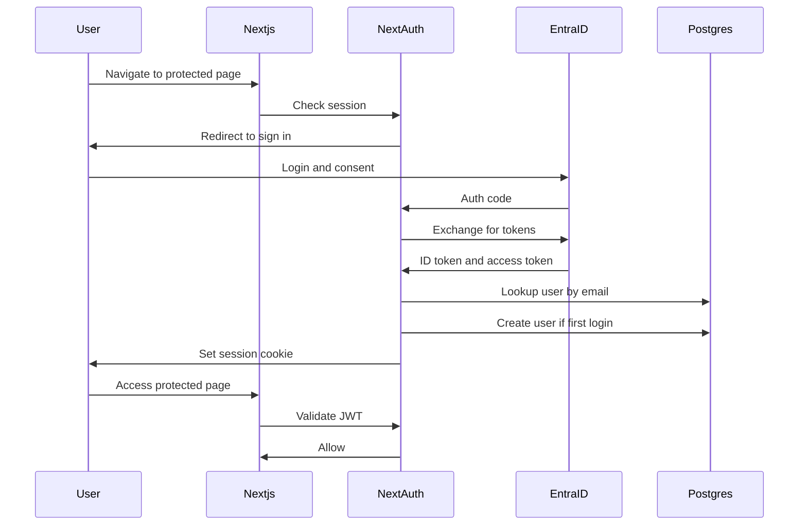
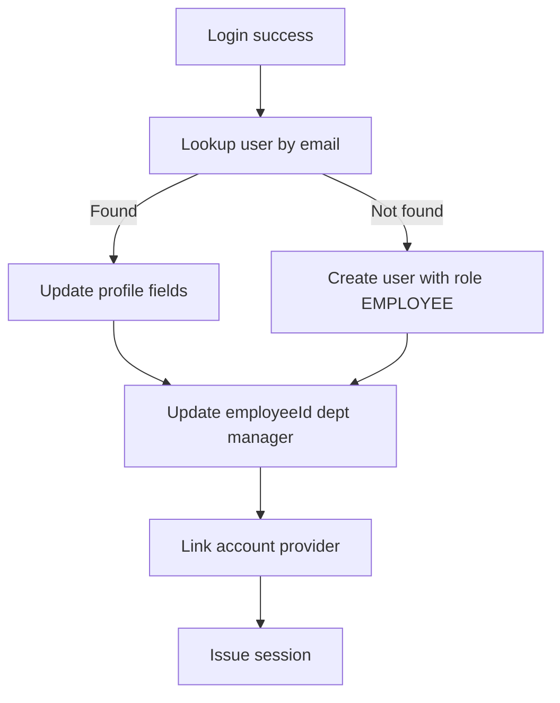

# AUTH_DESIGN.md

## 1. Purpose and Scope
- This document defines the authentication and authorization design for the Travel and Claim System.
- It aligns with [`architecture.md`](architecture.md:1) and [`travel-claim/prisma/schema.prisma`](travel-claim/prisma/schema.prisma:1).
- Scope covers NextAuth.js v5 with Microsoft Entra ID, JWT sessions, RBAC, and approval authorization.

### 1.1 Assumptions and Decisions
- Session strategy: JWT (stateless) with short-lived access tokens and refresh token handling.
- First-time login: create local user with default role EMPLOYEE; roles managed in-app.
- Entra ID group claims are not used for role mapping in the initial design.
- User provisioning syncs name, email, photo, employeeId, department, and manager references when available.

### 1.2 Key Entities
- User, Account, Session, Department, Approval, and role enums are defined in [`travel-claim/prisma/schema.prisma`](travel-claim/prisma/schema.prisma:1).
- Roles in schema: EMPLOYEE, SUPERVISOR, MANAGER, DIRECTOR, FINANCE, ADMIN.

## 2. High-Level Auth Flow


## 3. NextAuth.js Configuration Design
### 3.1 File Placement
- Auth config: [`travel-claim/src/server/auth/config.ts`](travel-claim/src/server/auth/config.ts:1).
- Auth entrypoint: [`travel-claim/src/server/auth/index.ts`](travel-claim/src/server/auth/index.ts:1).
- Route handler: [`travel-claim/src/app/api/auth/[...nextauth]/route.ts`](travel-claim/src/app/api/auth/[...nextauth]/route.ts:1).

### 3.2 Azure AD Provider Setup
- Use Microsoft Entra ID OAuth 2.0 / OIDC provider.
- Required scopes: openid, profile, email, offline_access, User.Read.
- Use tenant-specific endpoint for single-tenant org.

### 3.3 Configuration Skeleton
```ts
import AzureADProvider from "next-auth/providers/azure-ad";

export const authConfig = {
  providers: [
    AzureADProvider({
      clientId: process.env.AZURE_AD_CLIENT_ID,
      clientSecret: process.env.AZURE_AD_CLIENT_SECRET,
      tenantId: process.env.AZURE_AD_TENANT_ID,
      authorization: {
        params: {
          scope: "openid profile email offline_access User.Read"
        }
      }
    })
  ],
  session: { strategy: "jwt" },
  callbacks: {
    async signIn({ user, account, profile }) {
      // Create or update user record
      return true;
    },
    async jwt({ token, account, profile }) {
      // Persist role, employeeId, departmentId
      // Refresh tokens when nearing expiry
      return token;
    },
    async session({ session, token }) {
      // Expose user role and permissions to client
      return session;
    }
  }
};
```

### 3.4 Callback Responsibilities
- signIn: create or update local user using profile claims.
- jwt: attach role, employeeId, departmentId, supervisorId; store access token expiry and refresh token.
- session: expose role and permissions to client; avoid sending sensitive tokens.

### 3.5 Token Refresh Strategy
- Store refresh_token in Account table or encrypted token in JWT.
- On jwt callback, if access token near expiry, call Entra token endpoint to refresh.
- If refresh fails, force sign-out and redirect to login.

### 3.6 Environment Variables
- NEXTAUTH_URL
- NEXTAUTH_SECRET
- AZURE_AD_CLIENT_ID
- AZURE_AD_CLIENT_SECRET
- AZURE_AD_TENANT_ID
- AZURE_AD_REDIRECT_URI
- ENTRA_EMPLOYEE_ID_CLAIM
- ENTRA_DEPARTMENT_CLAIM
- ENTRA_MANAGER_ID_CLAIM

### 3.7 Error Handling
- Standardize auth errors: invalid_token, account_not_linked, access_denied.
- Log failures to AuditLog with action CREATE or UPDATE on auth events.
- Provide user-friendly errors with no sensitive details.

## 4. User Provisioning Flow


### 4.1 First-Time Login Detection
- Identify by email or providerAccountId lookup.
- If no user found, create user with role EMPLOYEE and status active.

### 4.2 Employee ID Mapping
- Use custom claim or standard Entra attribute.
- Recommended claim: extension_employeeId or onPremisesExtensionAttributes.
- Store in User.employeeId and keep unique index.

### 4.3 Department Assignment
- Use department claim from Entra or lookup table.
- If missing, assign to Unassigned department and flag for admin.

### 4.4 Manager Relationship
- Use managerEmployeeId claim or Manager object ID claim.
- Resolve to local user by employeeId or email.
- If unresolved, leave supervisorId null and schedule admin review.

## 5. Authorization Architecture
### 5.1 Role Model
- Role enum in schema includes SUPERVISOR; treat it as a distinct L1 approver role.
- If organization prefers 5 roles, map SUPERVISOR to MANAGER in policy.

### 5.2 Permission Matrix
| Capability | EMPLOYEE | SUPERVISOR | MANAGER | DIRECTOR | FINANCE | ADMIN |
|---|---|---|---|---|---|---|
| Create travel request | ✓ | ✓ | ✓ | ✓ | ✓ | ✓ |
| Submit claim | ✓ | ✓ | ✓ | ✓ | ✓ | ✓ |
| Approve L1 | ✗ | ✓ | ✓ | ✓ | ✓ | ✓ |
| Approve L2 | ✗ | ✗ | ✓ | ✓ | ✓ | ✓ |
| Approve L3+ | ✗ | ✗ | ✗ | ✓ | ✓ | ✓ |
| View team requests | ✗ | ✓ | ✓ | ✓ | ✓ | ✓ |
| View department requests | ✗ | ✗ | ✓ | ✓ | ✓ | ✓ |
| Finance close and pay | ✗ | ✗ | ✗ | ✗ | ✓ | ✓ |
| Admin manage roles | ✗ | ✗ | ✗ | ✗ | ✗ | ✓ |

### 5.3 Resource Ownership Rules
- Own resources: user can read and edit own draft submissions.
- Team resources: supervisor and manager can read team items.
- Department resources: manager and director can read department items.
- Finance can access approved and locked claims for payment processing.
- Admin can access all resources.

### 5.4 Approval Authority Matrix
- L1 approval: direct supervisor or SUPERVISOR role assigned for team.
- L2 approval: department manager.
- L3 approval: department director.
- L4 and L5: senior leadership or executive roles if enabled.
- Self-approval is disallowed except for DIRECTOR and ADMIN if configured.

## 6. Middleware Design
### 6.1 Route Protection
- Use Next.js middleware for page-level protection.
- Public routes: /, /api/auth/*, /health, /public assets.
- Protected routes: /travel, /claims, /approvals, /admin, /profile.

### 6.2 Middleware Logic
- Check session JWT and role.
- Redirect unauthenticated users to /api/auth/signin.
- Redirect authenticated users from /login to /.
- Enforce role-based access for /admin and /finance paths.

## 7. tRPC Context and Authorization
### 7.1 Context Fields
- session from NextAuth.
- user object hydrated from database with role, departmentId, supervisorId.
- permissions derived from role.

### 7.2 Authorization Helpers
- requireAuth: ensures authenticated user.
- requireRole: ensures role in allowed set.
- requirePermission: checks permission list.
- requireOwnership: checks user owns resource or is in allowed hierarchy.

### 7.3 Example Protected Procedure
```ts
const approveL2 = protectedProcedure
  .use(requireRole(["MANAGER", "DIRECTOR", "ADMIN"]))
  .mutation(async ({ ctx, input }) => {
    // Validate approval level and ownership rules
  });
```

## 8. Security Best Practices
- CSRF: enable NextAuth CSRF protection and sameSite cookies.
- XSS: use default React escaping and apply CSP headers.
- Session cookies: httpOnly, secure, sameSite lax or strict.
- Token storage: avoid exposing access token to client.
- Rate limiting: apply to /api/trpc and /api/auth endpoints.
- Audit logging: log authentication events and authorization denials.

## 9. Implementation Examples
### 9.1 Protected Page Example
```tsx
export default async function ApprovalsPage() {
  const session = await getServerSession();
  if (!session) redirect("/api/auth/signin");
  return <div>Approvals</div>;
}
```

### 9.2 Protected API Route Example
```ts
export async function GET() {
  const session = await auth();
  if (!session) return new Response("Unauthorized", { status: 401 });
  return new Response("OK");
}
```

### 9.3 Role Checking Hook Example
```ts
export function hasRole(session, roles) {
  return session?.user?.role && roles.includes(session.user.role);
}
```

## 10. Azure AD Setup Guide
### 10.1 App Registration
- Register single-tenant app in Entra.
- Redirect URI: https://yourdomain.com/api/auth/callback/azure-ad.
- Add required API permissions: openid, profile, email, offline_access, User.Read.

### 10.2 Token Configuration
- Add optional claims for employeeId, department, managerEmployeeId.
- Use extension attributes if built-in claims not available.

### 10.3 Custom Claims
- employeeId claim -> User.employeeId.
- department claim -> Department.code or Department.name.
- managerEmployeeId claim -> User.supervisorId mapping.

## 11. Testing Strategy
- Unit tests for permission and approval rules.
- Integration tests for NextAuth callbacks and JWT refresh.
- Mock auth for local development with seeded users.

## 12. Migration and Deployment
- Ensure environment variables set per stage.
- Migrate existing users by matching email and setting employeeId.
- Rollback: disable auth routes, restore previous auth config.

## 13. Implementation Checklist
- Configure Entra app registration and claims.
- Add env vars and secrets.
- Implement NextAuth config and callbacks.
- Add middleware protections.
- Add tRPC auth helpers.
- Verify RBAC and approval flows.

## 14. Troubleshooting
- Invalid redirect URI: check app registration and NEXTAUTH_URL.
- Missing employeeId: ensure claim is configured and exposed.
- Role mismatch: verify role assignment in admin UI.
- Token refresh failure: verify offline_access scope and refresh token persistence.