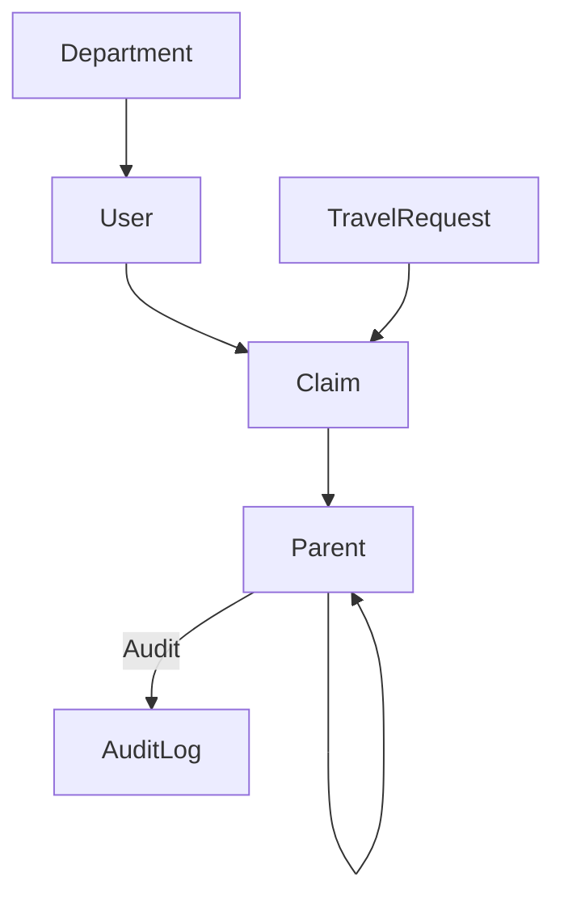

# Chart of Accounts (COA) Feature Design

## 1. Overview
This document outlines the design for integrating a Chart of Accounts (COA) feature into the travel claim management system. The COA will enable financial tracking, reporting, and compliance by associating claims with specific accounts.

## 2. ERD Diagram


## 3. COA Database Schema
### COA Model
```
model COA {
  id            String   @id @default(cuid())
  accountCode   String   @unique @db.VarChar(20)
  accountName   String   @db.VarChar(100)
  accountType   COAType
  category      String   @db.VarChar(50)
  subcategory   String?  @db.VarChar(50)
  parentId      String?
  parent        COA?     @relation("COAParent", fields: [parentId], references: [id])
  children      COA[]    @relation("COAParent")
  isActive      Boolean  @default(true)
  description   String?  @db.Text
  createdAt     DateTime @default(now())
  updatedAt     DateTime @updatedAt
  claims        Claim[]
  auditLogs     AuditLog[]

  @@index([accountCode])
  @@index([accountType])
  @@index([parentId])
}

enum COAType {
  ASSET
  LIABILITY
  EQUITY
  REVENUE
  EXPENSE
}
```

### Claim Model Integration
Add a COA reference to the Claim model:
```
model Claim {
  ...
  coaId      String?
  coa        COA?     @relation(fields: [coaId], references: [id])
  ...
}
```

## 4. Migration Strategy
- Create `COA` and `COAType` models.
- Add `coaId` field to `Claim` model.
- Update relations and indexes.
- Migrate existing claims (if needed) to assign default or mapped COA.
- Ensure audit logging for all COA changes.

## 5. API Endpoints
- `GET /api/coa` — List COA accounts
- `POST /api/coa` — Create new COA account
- `PUT /api/coa/{id}` — Update COA account
- `DELETE /api/coa/{id}` — Deactivate COA account (soft delete)
- `GET /api/claims?coaId={id}` — List claims by COA

## 6. Frontend Requirements
- COA Management UI: CRUD for accounts, hierarchy visualization, status toggle
- COA Selection in Claims: Dropdown/select for associating claim with COA
- Audit Trail: Display COA change history

## 7. Financial Reporting & Audit
- Expense allocation tracked via claim-to-COA association
- Support for hierarchical reporting (parent/child accounts)
- Audit logs for all COA changes (creation, update, deactivation)

## 8. Best Practices
- Unique account codes
- Hierarchical structure for flexible reporting
- Soft delete for deactivation
- Audit trail for compliance
- Timestamps for all records

---

**Location:** [`travel-claim/docs/CHART_OF_ACCOUNTS_DESIGN.md`](travel-claim/docs/CHART_OF_ACCOUNTS_DESIGN.md)
