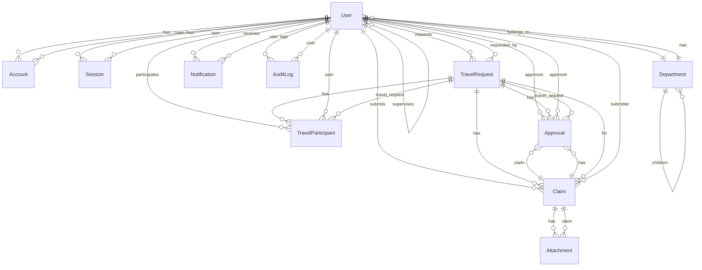

# Database Entity Relationship Diagram

This diagram visualizes the entity relationships defined in [`prisma/schema.prisma`](../prisma/schema.prisma).

## Entity Overview

### Core Entities

- **User**: Central entity representing system users with roles, departments, and supervision hierarchy
- **Department**: Organizational structure with hierarchical parent/child relationships
- **TravelRequest**: Travel authorization requests with participants, approvals, and claims
- **Claim**: Expense claims linked to travel requests (entertainment and non-entertainment)
- **Approval**: Multi-level approval workflow for travel requests and claims

### Supporting Entities

- **TravelParticipant**: Many-to-many relationship between users and travel requests
- **Attachment**: File attachments for claims with OCR capabilities
- **Notification**: Multi-channel notification system
- **AuditLog**: Comprehensive audit trail for all entities

### Authentication Entities (NextAuth.js)

- **Account**: OAuth provider accounts
- **Session**: User sessions
- **VerificationToken**: Email verification tokens

## Key Relationships

1. **User Hierarchy**: Users can supervise other users (self-referential relationship)
2. **Department Hierarchy**: Departments can have parent departments (self-referential relationship)
3. **Travel Workflow**: TravelRequest → TravelParticipant → Approval → Claim → Attachment
4. **Dual Approval**: Approvals can reference either TravelRequest OR Claim
5. **Activity Tracking**: Notifications and AuditLogs track user actions across the system