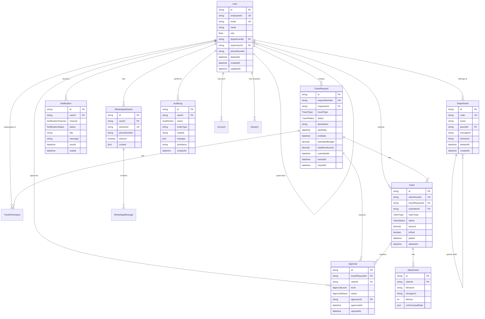

# Travel and Claim System - Database Schema Documentation

## Overview

This document provides comprehensive documentation for the Travel and Claim Management System database schema designed with Prisma ORM and PostgreSQL.

**Version:** 1.0  
**Last Updated:** 2026-02-06  
**Schema File:** [`prisma/schema.prisma`](prisma/schema.prisma:1)

---

## Entity Relationship Diagram



---

## Core Design Decisions

### 1. ID Strategy
- **Type:** CUID (Collision-resistant Unique Identifier)
- **Rationale:** 
  - URL-safe, sortable by creation time
  - Better than UUID v4 for distributed systems
  - No sequential information leak (security)
  - Prisma default for PostgreSQL

### 2. Soft Delete Pattern
- **Approach:** `deletedAt` timestamp field
- **Rationale:**
  - Allows data recovery
  - Maintains referential integrity
  - Supports audit requirements
  - NULL = active, timestamp = deleted
- **Applied To:** User, Department, TravelRequest, Claim, Attachment

### 3. Money Fields
- **Type:** `Decimal(15, 2)`
- **Rationale:**
  - Exact decimal arithmetic (no floating point errors)
  - 15 digits total, 2 decimal places
  - Handles up to 999,999,999,999.99
  - Single currency (IDR) for Phase 1
  - Future: Add `currencyCode` field when multi-currency needed

### 4. Approval System Design
- **Unified Model:** Single [`Approval`](prisma/schema.prisma:270) model for both travel requests and claims
- **Rationale:**
  - DRY principle - same approval logic
  - Simplified queries and code
  - Consistent approval tracking
  - Uses nullable foreign keys: `travelRequestId?` or `claimId?`

### 5. NextAuth.js Integration
- **Preserved Models:** [`Account`](prisma/schema.prisma:130), [`Session`](prisma/schema.prisma:149), [`VerificationToken`](prisma/schema.prisma:214)
- **Extended User Model:** Added business fields while keeping NextAuth compatibility
- **Rationale:**
  - Standard NextAuth adapter pattern
  - Microsoft Entra ID OAuth support
  - Session management built-in

---

## Key Relationships Explained

### User Hierarchy (Self-Referential)
```prisma
supervisor    User?     @relation("Supervision", fields: [supervisorId], references: [id])
directReports User[]    @relation("Supervision")
```
- Supports manager-employee relationships
- Enables dynamic approval routing based on hierarchy
- Named relation prevents ambiguity

### Department Hierarchy (Nested Structure)
```prisma
parent      Department?  @relation("DepartmentHierarchy", fields: [parentId], references: [id])
children    Department[] @relation("DepartmentHierarchy")
```
- Supports organizational tree structure
- Enables department-level reporting
- Allows flexible org chart changes

### Approval Polymorphism
```prisma
travelRequestId String?
travelRequest   TravelRequest?  @relation(...)
claimId         String?
claim           Claim?          @relation(...)
```
- One approval can link to EITHER travel request OR claim
- Business logic ensures exactly one is set
- Simplifies approval workflow code

### Claim Type Discrimination
```prisma
claimType       ClaimType  // ENTERTAINMENT or NON_ENTERTAINMENT

// Entertainment-specific (nullable)
entertainmentType    EntertainmentType?
guestName            String?

// Non-entertainment-specific (nullable)
expenseCategory      NonEntertainmentCategory?
customerName         String?
```
- Single table for all claim types (STI pattern)
- Type-specific fields are nullable
- Application validates correct fields based on `claimType`

---

## Index Strategy

### Performance Indexes

#### User Model
```prisma
@@index([employeeId])    // Lookup by employee ID
@@index([email])          // NextAuth login
@@index([departmentId])   // Department queries
@@index([supervisorId])   // Hierarchy queries
@@index([role])           // Role-based filtering
```

#### TravelRequest Model
```prisma
@@index([requesterId, status])   // User's requests by status
@@index([status, createdAt])     // Approval queue (chronological)
@@index([requestNumber])          // Lookup by number
@@index([travelType])             // Filter by type
@@index([startDate, endDate])     // Date range queries
```

#### Claim Model
```prisma
@@index([travelRequestId])        // Claims for a trip
@@index([submitterId, status])    // User's claims by status
@@index([status, createdAt])      // Processing queue
@@index([claimNumber])            // Lookup by number
@@index([claimType])              // Filter by type
```

#### Approval Model
```prisma
@@index([travelRequestId, level])  // Travel approval chain
@@index([claimId, level])          // Claim approval chain
@@index([approverId, status])      // Approver's pending queue
@@index([status, createdAt])       // Processing order
```

#### Notification Model
```prisma
@@index([userId, status])          // User's unread notifications
@@index([status, createdAt])       // Delivery queue
@@index([channel])                 // Channel-specific queries
```

#### AuditLog Model
```prisma
@@index([userId, createdAt])       // User activity timeline
@@index([entityType, entityId])    // Entity history
@@index([action, createdAt])       // Action-based filtering
```

### Unique Constraints

```prisma
// Natural keys
@@unique([provider, providerAccountId])  // OAuth accounts
@@unique([identifier, token])            // Verification tokens
@@unique([travelRequestId, userId])      // One role per trip per user

// Business identifiers
@unique employeeId
@unique email
@unique requestNumber
@unique claimNumber
@unique sessionId
@unique messageId
```

---

## Enum Definitions

### Role Hierarchy
```prisma
enum Role {
    EMPLOYEE       // Base level: submit requests/claims
    SUPERVISOR     // L1: approve direct reports
    MANAGER        // L2: approve department
    DIRECTOR       // L3+: approve division, self-approve
    FINANCE        // Close trips, mark payments
    ADMIN          // System administration
}
```

### Travel Request Lifecycle
```prisma
enum TravelStatus {
    DRAFT          // Created, not submitted
    SUBMITTED      // Awaiting L1 approval
    APPROVED_L1    // Supervisor approved
    APPROVED_L2    // Manager approved
    APPROVED_L3    // Director approved
    APPROVED_L4    // Senior director approved (rare)
    APPROVED_L5    // Executive approved (rare)
    REJECTED       // Rejected at any level
    REVISION       // Needs changes from requester
    LOCKED         // Approved, ready for claims
    CLOSED         // All claims paid, trip complete
}
```

### Claim Processing
```prisma
enum ClaimStatus {
    DRAFT          // Created, not submitted
    SUBMITTED      // Awaiting approval
    APPROVED       // Approved, awaiting payment
    REJECTED       // Rejected
    REVISION       // Needs corrections
    PAID           // Reimbursement completed
}
```

---

## Sample Queries

### 1. Get User's Pending Approvals
```typescript
const pendingApprovals = await prisma.approval.findMany({
  where: {
    approverId: userId,
    status: 'PENDING',
  },
  include: {
    travelRequest: {
      select: {
        requestNumber: true,
        purpose: true,
        destination: true,
        requester: {
          select: { name: true, email: true }
        }
      }
    },
    claim: {
      select: {
        claimNumber: true,
        amount: true,
        submitter: {
          select: { name: true }
        }
      }
    }
  },
  orderBy: { createdAt: 'asc' },
  take: 20
});
```

### 2. Get Travel Request with Full History
```typescript
const travelRequest = await prisma.travelRequest.findUnique({
  where: { id: requestId },
  include: {
    requester: {
      select: { name: true, email: true, department: true }
    },
    participants: {
      include: {
        user: {
          select: { name: true, email: true }
        }
      }
    },
    approvals: {
      include: {
        approver: {
          select: { name: true, role: true }
        }
      },
      orderBy: { level: 'asc' }
    },
    claims: {
      where: { deletedAt: null },
      include: {
        attachments: true,
        approvals: true
      }
    }
  }
});
```

### 3. Get User's Direct Reports
```typescript
const directReports = await prisma.user.findMany({
  where: {
    supervisorId: managerId,
    deletedAt: null,
  },
  select: {
    id: true,
    name: true,
    email: true,
    employeeId: true,
    role: true,
    department: {
      select: { name: true }
    },
    travelRequests: {
      where: {
        status: { in: ['SUBMITTED', 'APPROVED_L1'] }
      },
      select: {
        id: true,
        requestNumber: true,
        destination: true,
        status: true
      }
    }
  }
});
```

### 4. Calculate Total Claims for Trip
```typescript
const tripSummary = await prisma.travelRequest.findUnique({
  where: { id: tripId },
  select: {
    requestNumber: true,
    destination: true,
    estimatedBudget: true,
    claims: {
      where: {
        status: { in: ['APPROVED', 'PAID'] },
        deletedAt: null
      },
      select: {
        amount: true,
        status: true
      }
    }
  }
});

const totalClaimed = tripSummary.claims.reduce(
  (sum, claim) => sum + claim.amount.toNumber(), 
  0
);
```

### 5. Search Claims by Date Range
```typescript
const claims = await prisma.claim.findMany({
  where: {
    OR: [
      {
        claimType: 'ENTERTAINMENT',
        entertainmentDate: {
          gte: startDate,
          lte: endDate
        }
      },
      {
        claimType: 'NON_ENTERTAINMENT',
        expenseDate: {
          gte: startDate,
          lte: endDate
        }
      }
    ],
    deletedAt: null
  },
  include: {
    submitter: {
      select: { name: true, employeeId: true }
    },
    travelRequest: {
      select: { requestNumber: true, destination: true }
    }
  },
  orderBy: [
    { status: 'asc' },
    { createdAt: 'desc' }
  ]
});
```

### 6. Get Audit Trail for Entity
```typescript
const auditTrail = await prisma.auditLog.findMany({
  where: {
    entityType: 'TravelRequest',
    entityId: requestId
  },
  include: {
    user: {
      select: { name: true, email: true, role: true }
    }
  },
  orderBy: { createdAt: 'desc' }
});
```

### 7. Get WhatsApp Session Context
```typescript
const session = await prisma.whatsAppSession.findUnique({
  where: { sessionId: sessionId },
  include: {
    user: {
      select: { 
        name: true, 
        email: true,
        travelRequests: {
          where: {
            status: { in: ['LOCKED', 'APPROVED_L1', 'APPROVED_L2', 'APPROVED_L3'] },
            deletedAt: null
          },
          select: {
            id: true,
            requestNumber: true,
            destination: true,
            startDate: true,
            endDate: true
          }
        }
      }
    },
    messages: {
      orderBy: { createdAt: 'desc' },
      take: 10
    }
  }
});
```

---

## Migration Considerations

### Initial Migration
```bash
# Generate initial migration
npx prisma migrate dev --name init

# Apply to production
npx prisma migrate deploy
```

### Data Seeding Strategy
```typescript
// prisma/seed.ts
import { PrismaClient, Role } from '@prisma/client';

const prisma = new PrismaClient();

async function main() {
  // Seed departments
  const itDept = await prisma.department.create({
    data: {
      name: 'Information Technology',
      code: 'IT',
      description: 'Technology and systems'
    }
  });

  // Seed admin user
  const admin = await prisma.user.create({
    data: {
      email: 'admin@company.com',
      name: 'System Administrator',
      employeeId: 'EMP001',
      role: Role.ADMIN,
      departmentId: itDept.id,
      emailVerified: new Date()
    }
  });

  console.log('Seed completed');
}

main()
  .catch(console.error)
  .finally(() => prisma.$disconnect());
```

### Future Schema Changes

#### Adding Multi-Currency Support
```prisma
model TravelRequest {
  // Add fields:
  currencyCode        String    @default("IDR") @db.VarChar(3)
  exchangeRate        Decimal?  @db.Decimal(10, 6)
}

model Claim {
  // Add fields:
  currencyCode        String    @default("IDR") @db.VarChar(3)
  amountInBaseCurrency Decimal? @db.Decimal(15, 2)
}
```

#### Adding Budget Management
```prisma
model Budget {
  id              String    @id @default(cuid())
  departmentId    String
  department      Department @relation(...)
  year            Int
  quarter         Int?
  amount          Decimal   @db.Decimal(15, 2)
  spent           Decimal   @db.Decimal(15, 2) @default(0)
  category        String    @db.VarChar(50)
  
  @@unique([departmentId, year, quarter, category])
}
```

---

## Performance Optimization Tips

### 1. Query Optimization
```typescript
// ❌ N+1 Query Problem
const requests = await prisma.travelRequest.findMany();
for (const req of requests) {
  const requester = await prisma.user.findUnique({ 
    where: { id: req.requesterId } 
  });
}

// ✅ Use include/select
const requests = await prisma.travelRequest.findMany({
  include: {
    requester: {
      select: { name: true, email: true }
    }
  }
});
```

### 2. Pagination
```typescript
// ✅ Cursor-based pagination for large datasets
const claims = await prisma.claim.findMany({
  take: 20,
  skip: 1,
  cursor: { id: lastClaimId },
  orderBy: { createdAt: 'desc' }
});
```

### 3. Selective Field Loading
```typescript
// ❌ Loading unnecessary data
const user = await prisma.user.findUnique({ where: { id } });

// ✅ Select only needed fields
const user = await prisma.user.findUnique({
  where: { id },
  select: { 
    id: true, 
    name: true, 
    email: true, 
    role: true 
  }
});
```

### 4. Batch Operations
```typescript
// ✅ Create multiple records efficiently
await prisma.notification.createMany({
  data: [
    { userId: user1, title: 'Alert', message: '...' },
    { userId: user2, title: 'Alert', message: '...' },
  ],
  skipDuplicates: true
});
```

### 5. Transaction Usage
```typescript
// ✅ Ensure atomicity for complex operations
await prisma.$transaction(async (tx) => {
  // Approve travel request
  await tx.travelRequest.update({
    where: { id: requestId },
    data: { status: 'APPROVED_L2' }
  });
  
  // Update approval record
  await tx.approval.update({
    where: { id: approvalId },
    data: { 
      status: 'APPROVED',
      approvedAt: new Date()
    }
  });
  
  // Create notification
  await tx.notification.create({
    data: {
      userId: requesterId,
      title: 'Request Approved',
      message: '...',
      channel: 'EMAIL'
    }
  });
});
```

---

## Security Considerations

### 1. Row-Level Security (Application Layer)
```typescript
// Always filter by user context
const claims = await prisma.claim.findMany({
  where: {
    AND: [
      { submitterId: currentUserId }, // User's own claims
      { deletedAt: null }             // Not deleted
    ]
  }
});
```

### 2. Soft Delete Enforcement
```typescript
// Create Prisma middleware for soft delete
prisma.$use(async (params, next) => {
  if (params.action === 'delete') {
    params.action = 'update';
    params.args['data'] = { deletedAt: new Date() };
  }
  if (params.action === 'deleteMany') {
    params.action = 'updateMany';
    if (params.args.data !== undefined) {
      params.args.data['deletedAt'] = new Date();
    } else {
      params.args['data'] = { deletedAt: new Date() };
    }
  }
  return next(params);
});
```

### 3. Audit Logging Helper
```typescript
async function createAuditLog(
  userId: string,
  action: AuditAction,
  entityType: string,
  entityId: string,
  changes?: any,
  req?: Request
) {
  await prisma.auditLog.create({
    data: {
      userId,
      action,
      entityType,
      entityId,
      changes,
      ipAddress: req?.ip,
      userAgent: req?.headers['user-agent']
    }
  });
}
```

---

## Database Maintenance

### Backup Strategy
```bash
# Daily automated backup
pg_dump -U postgres -d travelclaim -F c -b -v -f backup_$(date +%Y%m%d).dump

# Restore from backup
pg_restore -U postgres -d travelclaim -v backup_20260206.dump
```

### Performance Monitoring
```sql
-- Check table sizes
SELECT 
  schemaname,
  tablename,
  pg_size_pretty(pg_total_relation_size(schemaname||'.'||tablename)) AS size
FROM pg_tables
WHERE schemaname = 'public'
ORDER BY pg_total_relation_size(schemaname||'.'||tablename) DESC;

-- Check slow queries (if enabled)
SELECT 
  query,
  calls,
  total_time,
  mean_time,
  max_time
FROM pg_stat_statements
ORDER BY mean_time DESC
LIMIT 10;

-- Check index usage
SELECT 
  schemaname,
  tablename,
  indexname,
  idx_scan,
  idx_tup_read,
  idx_tup_fetch
FROM pg_stat_user_indexes
WHERE idx_scan = 0
ORDER BY schemaname, tablename;
```

### Maintenance Tasks
```sql
-- Vacuum and analyze (run weekly)
VACUUM ANALYZE;

-- Reindex (if needed)
REINDEX DATABASE travelclaim;

-- Update statistics
ANALYZE;
```

---

## Conclusion

This database schema provides a solid foundation for the Travel and Claim Management System with:

✅ **Comprehensive Coverage**: All business entities from the architecture document  
✅ **Performance**: Strategic indexes for common queries  
✅ **Scalability**: Designed to handle growth in users and transactions  
✅ **Flexibility**: Soft deletes, audit logs, extensible structure  
✅ **Security**: Role-based access control, audit trails  
✅ **Integration**: NextAuth support, WhatsApp integration, file storage  

**Next Steps:**
1. Review and approve schema design
2. Run initial migration: `npx prisma migrate dev`
3. Create seed data for development
4. Implement tRPC routers using this schema
5. Build business logic layer with Prisma queries

---

## References

- [Prisma Documentation](https://www.prisma.io/docs)
- [PostgreSQL Documentation](https://www.postgresql.org/docs/)
- [Architecture Document](../architecture.md)
- [NextAuth Prisma Adapter](https://next-auth.js.org/adapters/prisma)