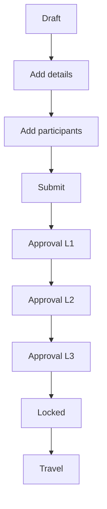
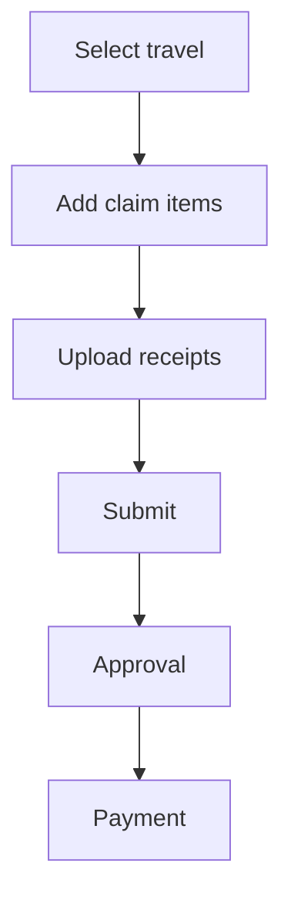
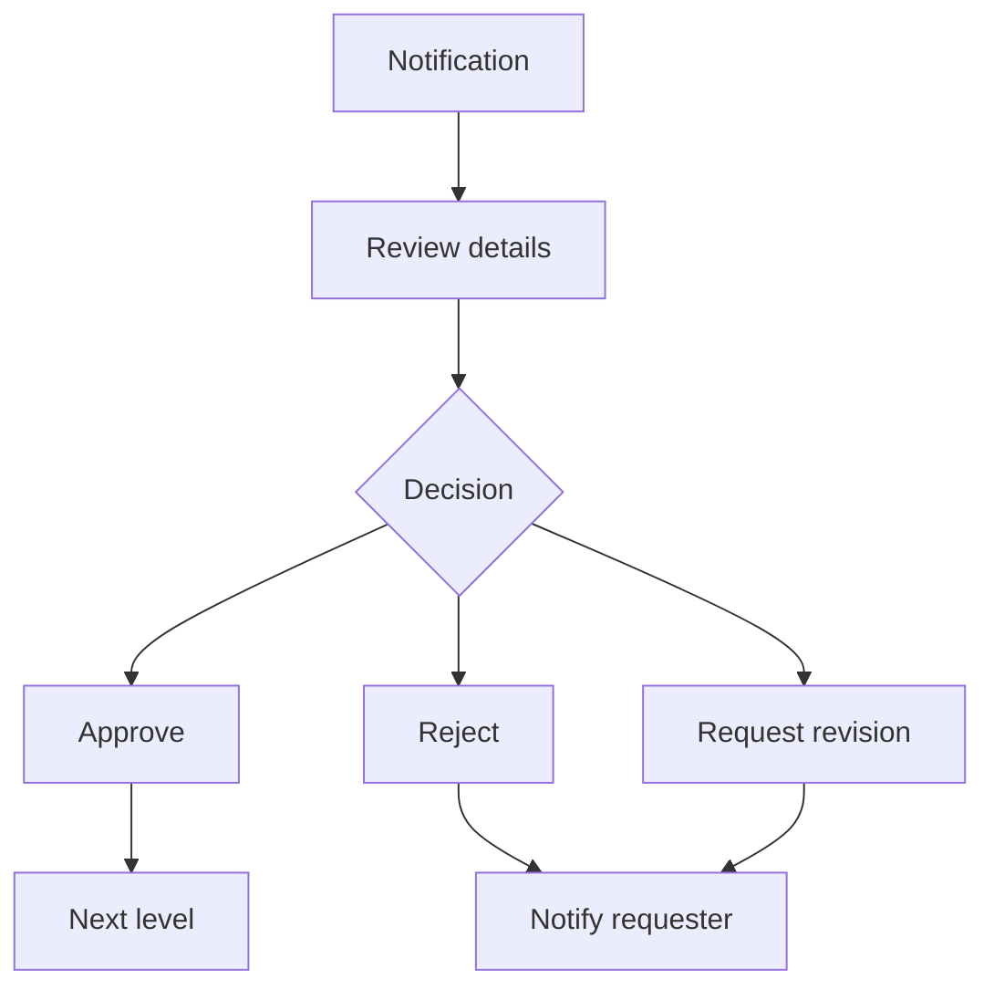
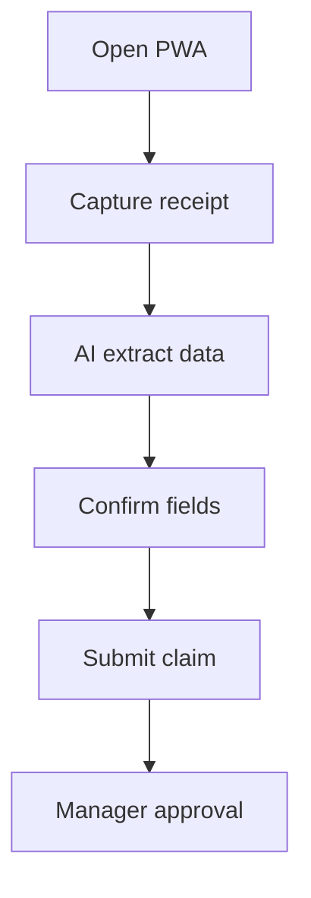
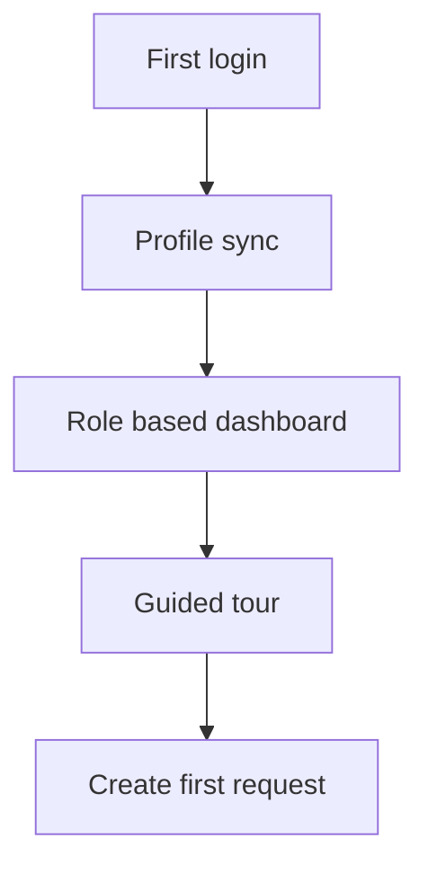

# FRONTEND_DESIGN.md

## Overview
This document defines the frontend architecture, page designs, component catalog, and user flows for the Travel and Claim System built with Next.js 14 App Router, React, TypeScript, and Tailwind CSS.

### References
- [`architecture.md`](architecture.md:1)
- [`AUTH_DESIGN.md`](AUTH_DESIGN.md:1)
- [`API_DESIGN.md`](API_DESIGN.md:1)
- [`travel-claim/prisma/schema.prisma`](travel-claim/prisma/schema.prisma:1)

### Design Principles
- Mobile-first, responsive layouts
- WCAG 2.1 AA accessibility
- Progressive enhancement and offline-first for critical flows
- Fast initial load and minimal client bundles
- Consistent navigation and clear status visibility

## 1. Application Structure
### 1.1 App Router and File Structure
```
travel-claim/src/
├── app/
│   ├── (public)/
│   │   ├── page.tsx                # Landing
│   │   └── login/page.tsx          # Microsoft sign-in
│   ├── (app)/
│   │   ├── layout.tsx              # App shell
│   │   ├── page.tsx                # Role dashboard
│   │   ├── travel/
│   │   │   ├── page.tsx            # List
│   │   │   ├── new/page.tsx        # Create
│   │   │   └── [id]/page.tsx       # Detail
│   │   ├── claims/
│   │   │   ├── page.tsx
│   │   │   ├── new/page.tsx
│   │   │   └── [id]/page.tsx
│   │   ├── approvals/
│   │   │   ├── page.tsx            # Queue
│   │   │   └── [id]/page.tsx       # Approval detail
│   │   ├── finance/
│   │   │   ├── page.tsx            # Finance dashboard
│   │   │   ├── payments/page.tsx
│   │   │   └── reports/page.tsx
│   │   ├── admin/
│   │   │   ├── page.tsx
│   │   │   ├── users/page.tsx
│   │   │   ├── config/page.tsx
│   │   │   └── audit-logs/page.tsx
│   │   └── profile/page.tsx
│   ├── api/                        # tRPC + auth
│   ├── layout.tsx                  # Root layout
│   ├── loading.tsx
│   └── error.tsx
├── components/
│   ├── layouts/
│   ├── navigation/
│   ├── forms/
│   ├── tables/
│   ├── charts/
│   └── ui/                         # shadcn ui
├── lib/
│   ├── auth/
│   ├── rbac/
│   ├── api/
│   └── constants/
└── styles/
    └── globals.css
```

### 1.2 Route Organization
- `(public)` for unauthenticated landing and login
- `(app)` for all protected routes with role-based navigation
- Nested segments for feature domains travel, claims, approvals, finance, admin
- `loading.tsx` and `error.tsx` at root and per segment for resilient UX

### 1.3 Layout Hierarchy
- Root layout: HTML shell, metadata, font loading
- App layout: app shell with sidebar, top header, breadcrumbs
- Feature layouts: optional nested layouts for travel, claims, admin
- Mobile layout: collapsible sidebar, bottom navigation

### 1.4 Loading and Error States
- Page-level `loading.tsx`: skeletons for lists and detail pages
- Route-level `error.tsx`: friendly error summary with retry action
- Inline loading: buttons, tables, and upload components show busy states

### 1.5 Metadata and SEO
- Public pages include OG metadata and canonical URL
- Protected pages include role-specific titles and noindex
- Use `generateMetadata` per route for dynamic titles, description, and breadcrumbs

## 2. Page Designs
### 2.1 Public Pages
- Landing page: product overview, benefits, security, CTA to login
- Login page: Microsoft sign-in, tenant help, privacy links

### 2.2 Protected Pages by Feature
#### Dashboard
- Role-based dashboard cards, pending items, quick actions
- Employee: my requests, claim status, upcoming travel
- Manager and Director: approvals queue, team stats, risk alerts
- Finance: payment pipeline, total outstanding, aging claims
- Admin: user and system health overview

#### Travel Requests
- List view with filters status, travel type, date range, requester
- Create and edit: multi-step draft flow
- Detail view: request summary, participants, approvals timeline, claims link
- Status tracker: draft to locked to closed

#### Claims
- List view with filters status, claim type, travel request
- Create form: entertainment vs non-entertainment
- Detail view: claim data, approval history, attachments
- Receipt viewer: image carousel and pdf viewer

#### Approvals
- Pending approvals list with quick approve actions
- Approval detail: request or claim info, history, comments
- Quick approve modal with optional notes

#### Profile and Settings
- Profile details, notification preferences, locale and timezone

#### Finance
- Payment tracking list, bulk actions, export reports
- Finance dashboard: totals paid, outstanding, processing SLA

#### Admin
- User management: roles, department assignment, activation
- System config: approval rules, expense categories, limits
- Audit logs with filters and export

### 2.3 Role-based Access Rules
| Route group | Employee | Supervisor | Manager | Director | Finance | Admin |
|---|---|---|---|---|---|---|
| dashboard | view | view | view | view | view | view |
| travel | own | own and team | dept | dept | view | view |
| claims | own | own and team | dept | dept | view | view |
| approvals | none | L1 | L1 and L2 | L1 to L3 | L1 to L3 | all |
| finance | none | none | none | none | full | full |
| admin | none | none | none | none | none | full |

## 3. Component Architecture
### 3.1 Layout Components
- AppShell: grid with sidebar, top header, content area
- SidebarNav: role-aware navigation, active state, collapsible
- TopHeader: search, notifications, user menu
- Breadcrumbs: derived from route segments
- PageHeader: title, status badge, primary and secondary actions

### 3.2 Feature Components
- TravelRequestCard: summary, status badge, key dates, amount
- ClaimCard: claim type, amount, status, attachments count
- ApprovalCard: requester, type, amount, action buttons
- StatusBadge: variant for draft, submitted, approved, locked, closed
- NotificationBell: unread count, dropdown list, mark read
- UserAvatarMenu: profile, settings, sign out

### 3.3 Form Components
- TravelRequestForm: multi-step with autosave draft
- EntertainmentClaimForm: guest info, government toggle, receipt upload
- NonEntertainmentClaimForm: category, date, amount, receipt upload
- ParticipantSelector: multi-select with search and roles
- DateRangePicker: start and end date with validation
- FileUpload: drag and drop, preview, progress, retry
- FormValidationFeedback: inline errors and summary

### 3.4 Data Display Components
- DataTable: sorting, filtering, pagination, column visibility
- StatusTimeline: approval levels with timestamps
- ApprovalHistory: comments and decision log
- StatCard: label, value, delta, trend icon
- Charts: line and bar for travel and spend trends
- EmptyState: icon, guidance, CTA
- LoadingSkeletons: list, card, detail layouts

### 3.5 Action Components
- ApproveRejectModal: action, notes, confirm
- RevisionRequestModal: feedback and due date
- ConfirmationDialog: delete draft, submit claim
- NotificationToast: success, error, warning
- QuickActionsMenu: context actions per row

### 3.6 Component Props and Variants
- Buttons: size sm md lg, variant primary secondary ghost destructive
- Inputs: default, error, success, disabled, with icon
- Cards: compact, standard, highlighted
- Tables: dense and comfortable

## 4. State Management Strategy
- Server components for data fetching lists and detail pages
- Client components for forms, interactive tables, and modals
- React Hook Form for complex forms with Zod validation
- tRPC queries for cache and type safety
- Optimistic updates for approve and reject actions
- Cache invalidation on mutate for travel, claim, approval lists

## 5. UI and UX System
### 5.1 Color Palette
- Primary: #2563EB
- Primary dark: #1D4ED8
- Neutral scale: #111827, #374151, #6B7280, #E5E7EB, #F9FAFB
- Success: #16A34A
- Warning: #D97706
- Danger: #DC2626
- Info: #0EA5E9

### 5.2 Typography
- Font: Inter or system sans
- Scale: 12, 14, 16, 18, 20, 24, 30, 36
- Headings: semibold, body: normal

### 5.3 Spacing and Layout
- Spacing scale: 4, 8, 12, 16, 24, 32, 40, 48
- Grid: 12 columns desktop, 4 columns mobile
- Touch targets: minimum 44 by 44

### 5.4 Responsive Breakpoints
- sm 640, md 768, lg 1024, xl 1280
- Mobile: bottom navigation, sticky primary CTA

### 5.5 Interaction Patterns
- Loading: skeletons and spinners
- Errors: inline field errors and page banners
- Success: toasts and status updates
- Keyboard: focus rings, skip to content

### 5.6 Accessibility Checklist
- ARIA labels for form controls and menus
- Visible focus states for all interactive elements
- Color contrast 4.5 to 1 minimum
- Form errors announced with aria live
- Keyboard operable modals and dropdowns

## 6. PWA Features
- Service worker cache first for static assets
- Network first for API calls with offline fallback
- Offline queue for draft claims and approvals
- Install prompt on second visit
- Push notifications for approvals and status updates
- Camera access for receipt capture in claim form
- Manifest with app icons and theme color

## 7. User Flow Diagrams
### 7.1 Travel Request Flow


### 7.2 Claims Submission Flow


### 7.3 Approval Decision Flow


### 7.4 WhatsApp and PWA Claim Flow


### 7.5 First Time User Onboarding


## 8. Wireframe Text Descriptions
### 8.1 Employee Dashboard
- Top row: stat cards for pending approvals, open claims, upcoming travel
- Middle: recent travel requests table
- Right rail: notifications and quick actions

### 8.2 Manager and Director Dashboard
- Left: pending approvals list with quick actions
- Center: team travel and claims charts
- Right: escalations and overdue items

### 8.3 Finance Dashboard
- KPI cards for paid today, pending payments, total outstanding
- Table: approved claims ready for payment

### 8.4 Admin Dashboard
- User management shortcuts and system health
- Audit log preview

### 8.5 Travel Request Form
- Step 1: trip details, purpose, destination, dates
- Step 2: budget and project metadata
- Step 3: participants and submit
- Sticky footer with save draft and submit

### 8.6 Approvals Page
- Table of pending approvals with status badges and action menu
- Detail drawer showing request summary and history

### 8.7 Claims Submission
- Toggle for entertainment vs non-entertainment
- Receipt upload on top, form fields below
- Inline receipt preview with delete

### 8.8 Mobile PWA Screens
- Bottom navigation: dashboard, travel, claims, approvals
- Large primary CTA and swipe to approve

## 9. Performance Optimization
- Route level code splitting and dynamic imports for charts
- Image optimization for receipts with `next/image`
- Prefetch list routes and details on hover
- Limit client components to interactive sections
- Target main bundle under 200 KB

## 10. Component Library Recommendations
- shadcn ui + Radix primitives
- Tailwind CSS utilities
- Icons: Lucide React
- Date pickers: react-day-picker
- Tables: TanStack Table
- Charts: Recharts

## 11. Testing Strategy
- Unit tests for UI utilities and components
- Integration tests for page flows with mocked tRPC
- E2E tests for travel request and claim submission flows
- Accessibility testing with axe

## 12. Appendix
### 12.1 Frontend to API Alignment
- Travel list uses travel.list and travel.getById
- Claim list uses claim.list and claim.getById
- Approval queue uses approval.getPending and approval.getHistory
- Notifications use notification.list and notification.markAsRead

### 12.2 Key Files
- App shell layout: [`travel-claim/src/app/(app)/layout.tsx`](travel-claim/src/app/(app)/layout.tsx:1)
- Root layout: [`travel-claim/src/app/layout.tsx`](travel-claim/src/app/layout.tsx:1)
- tRPC client: [`travel-claim/src/trpc/react.tsx`](travel-claim/src/trpc/react.tsx:1)