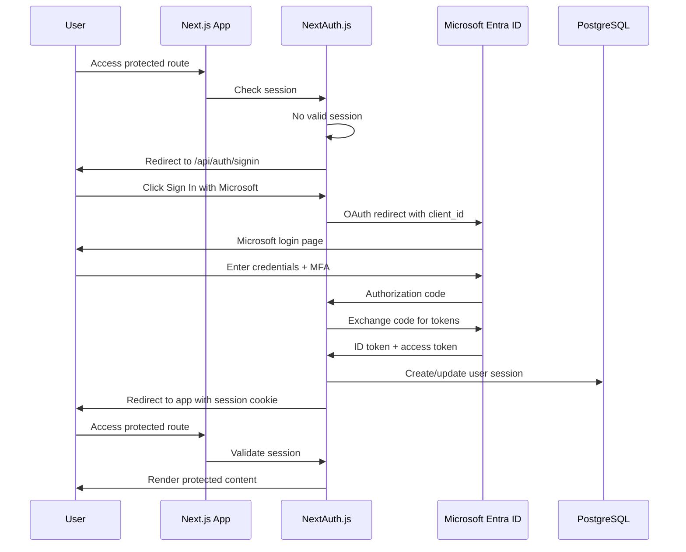
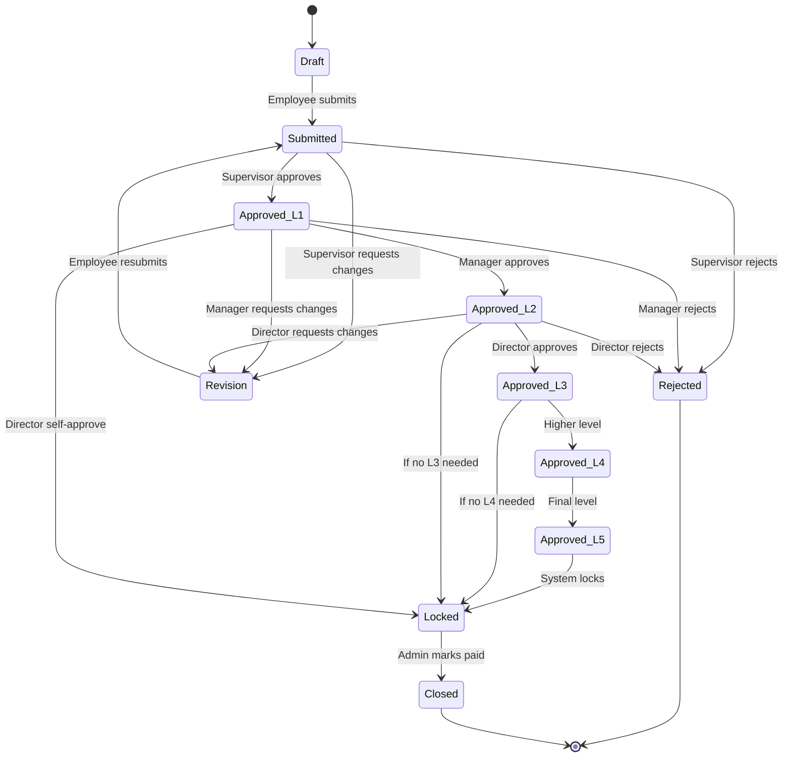
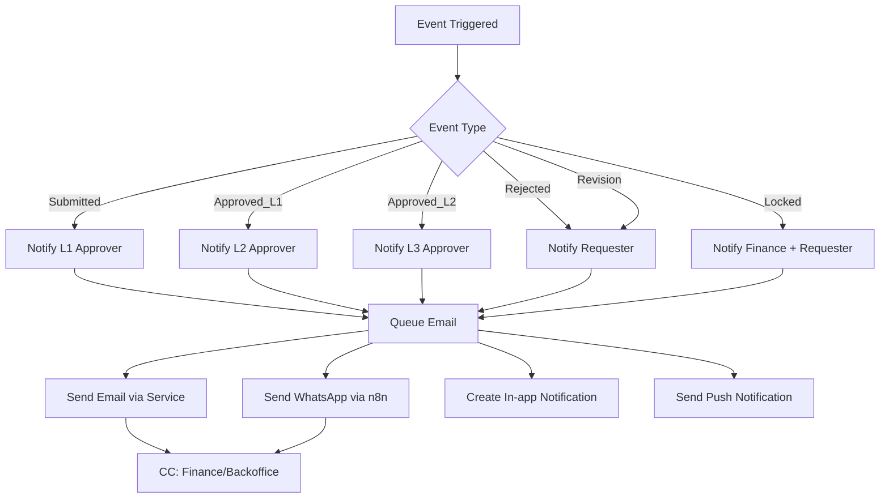
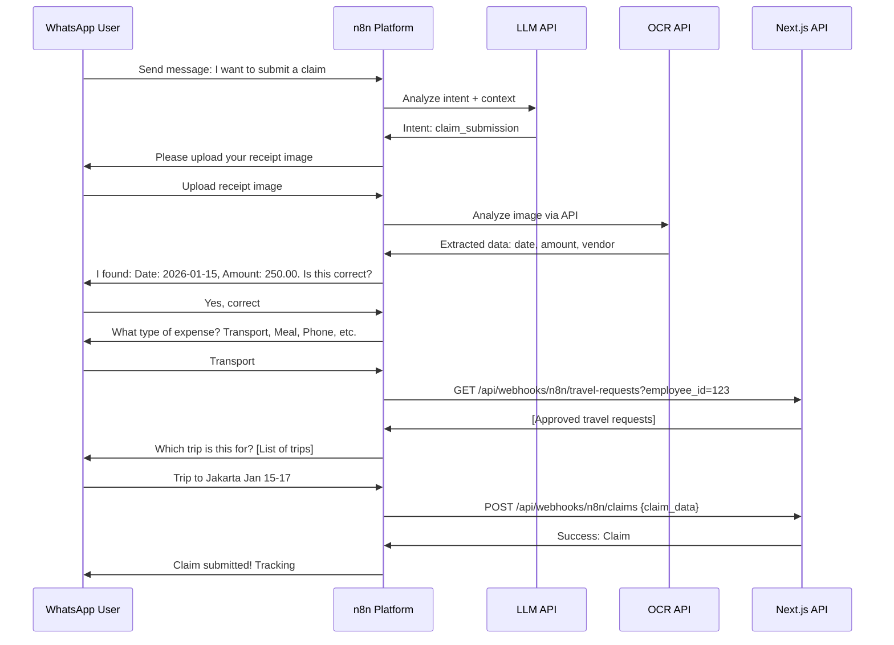

# Travel and Claim System - Architecture & Technical Specifications

## Document Overview

**Project:** Travel and Claim Management System  
**Technology Stack:** T3 Stack (Next.js, TypeScript, Prisma, tRPC)  
**Deployment:** Docker on VPS  
**Version:** 1.0  
**Last Updated:** 2026-02-06

---

## 1. Technology Stack Justification

### 1.1 T3 Stack Components

#### Next.js 14+ (App Router)
**Why:** Modern React framework with enterprise-grade features
- **Server Components**: Reduce client bundle size, improve performance
- **Server Actions**: Simplify form submissions and mutations
- **API Routes**: Built-in API layer for webhooks and integrations
- **File-based Routing**: Intuitive structure for complex workflows
- **Image Optimization**: Handle receipt/invoice images efficiently
- **PWA Support**: Native support for Progressive Web App features

#### TypeScript
**Why:** Type safety and developer experience
- **End-to-end Type Safety**: From database to UI with Prisma and tRPC
- **Early Error Detection**: Catch issues at compile time
- **Better IDE Support**: IntelliSense for complex business logic
- **Refactoring Confidence**: Safe changes across approval workflows
- **Documentation**: Self-documenting code through types

#### Prisma ORM
**Why:** Modern database toolkit optimized for TypeScript
- **Type-safe Database Access**: Generated types from schema
- **Migration Management**: Version control for database changes
- **Relation Management**: Complex approval hierarchies and joins
- **Query Performance**: Optimized queries with relation loading
- **PostgreSQL Support**: Robust ACID compliance for financial data
- **Database Seeding**: Easy setup for development/testing

#### tRPC
**Why:** End-to-end type-safe API layer
- **No Code Generation**: Types flow directly from server to client
- **Developer Experience**: Auto-complete for all API calls
- **Reduced Boilerplate**: No REST/GraphQL schema maintenance
- **Validation**: Zod integration for runtime validation
- **Real-time Subscriptions**: WebSocket support for notifications
- **Batching**: Automatic request batching for performance

#### NextAuth.js (Auth.js v5)
**Why:** Authentication framework with Microsoft Entra support
- **Provider Support**: Built-in Microsoft Entra ID (Azure AD) integration
- **Session Management**: JWT or database sessions
- **Role-based Access**: Custom callbacks for RBAC
- **Security**: Industry-standard OAuth 2.0 / OpenID Connect
- **Extensibility**: Custom pages and user flows

### 1.2 Supporting Technologies

#### Database: PostgreSQL
- **ACID Compliance**: Critical for financial transactions
- **JSON Support**: Flexible metadata storage
- **Full-text Search**: Search claims and travel requests
- **Row-level Security**: Additional security layer
- **Mature Ecosystem**: Extensive tooling and support

#### Caching: Redis (Optional)
- **Session Store**: Fast session lookup
- **Rate Limiting**: API protection
- **Queue Management**: Background job processing
- **Real-time Features**: Pub/sub for notifications

#### Object Storage: Cloudflare R2 (Optional)
- **S3-Compatible API**: Easy migration path
- **Cost-effective**: No egress fees
- **CDN Integration**: Fast receipt image delivery
- **Scalability**: Handle growing file volumes

#### Email Service
- **Resend or SendGrid**: Transactional emails
- **Template Support**: HTML email templates
- **Delivery Tracking**: Monitor notification success

---

## 2. System Architecture

### 2.1 High-Level Architecture

```
┌─────────────────────────────────────────────────────────────────┐
│                         Client Layer                             │
├─────────────────────────────────────────────────────────────────┤
│  PWA Web App (Next.js)          │    WhatsApp Interface         │
│  - Progressive Web App           │    (via n8n automation)       │
│  - Offline Support               │    - Chat interface           │
│  - Mobile-first UI               │    - Image upload             │
│  - Push Notifications            │    - AI-assisted forms        │
└──────────────┬──────────────────┴─────────────┬─────────────────┘
               │                                 │
               │ HTTPS                          │ Webhook
               │                                 │
┌──────────────▼─────────────────────────────────▼─────────────────┐
│                    Application Layer (Docker)                     │
├───────────────────────────────────────────────────────────────────┤
│  Next.js App (Port 3000)                                          │
│  ┌─────────────────────────────────────────────────────────────┐ │
│  │  Server Components        │   API Routes                    │ │
│  │  - SSR Pages              │   - /api/webhooks/n8n          │ │
│  │  - React Server Actions   │   - /api/webhooks/whatsapp     │ │
│  │                           │   - /api/trpc/*                 │ │
│  ├─────────────────────────────────────────────────────────────┤ │
│  │  tRPC Router Layer                                          │ │
│  │  - Travel Request Procedures                                │ │
│  │  - Claims Procedures                                        │ │
│  │  - Approval Procedures                                      │ │
│  │  - User Management                                          │ │
│  ├─────────────────────────────────────────────────────────────┤ │
│  │  Business Logic Layer                                       │ │
│  │  - Approval Workflow Engine                                 │ │
│  │  - Notification Service                                     │ │
│  │  - File Upload Service                                      │ │
│  │  - Validation Service                                       │ │
│  └─────────────────────────────────────────────────────────────┘ │
└───────────────────────────┬───────────────────────────────────────┘
                            │
        ┌───────────────────┼───────────────────┐
        │                   │                   │
        │                   │                   │
┌───────▼─────────┐  ┌──────▼────────┐  ┌──────▼──────────┐
│   PostgreSQL    │  │  Redis Cache  │  │  File Storage   │
│   (Primary DB)  │  │  (Optional)   │  │  (R2/Local)     │
│                 │  │               │  │                 │
│  - User data    │  │  - Sessions   │  │  - Receipts     │
│  - Travel reqs  │  │  - Rate limit │  │  - Invoices     │
│  - Claims       │  │  - Job queue  │  │  - Documents    │
│  - Approvals    │  │               │  │                 │
└─────────────────┘  └───────────────┘  └─────────────────┘

┌───────────────────────────────────────────────────────────────────┐
│                    External Integrations                          │
├───────────────────────────────────────────────────────────────────┤
│  Microsoft Entra ID  │  n8n Automation   │  Email Service        │
│  (OAuth/OIDC)        │  (WhatsApp + AI)  │  (Notifications)      │
└───────────────────────────────────────────────────────────────────┘
```

### 2.2 Component Breakdown

#### Frontend Layer (Next.js Client)
- **Pages/Routes:**
  - `/` - Dashboard
  - `/travel/new` - Create travel request
  - `/travel/[id]` - View/edit travel request
  - `/claims/new` - Submit claim
  - `/claims/[id]` - View/edit claim
  - `/approvals` - Approval queue
  - `/profile` - User profile and settings
  - `/admin` - Admin panel

- **Components:**
  - Reusable form components with validation
  - Approval status indicators
  - File upload with preview
  - Notification center
  - Mobile-optimized layouts

#### Backend API Layer (tRPC)
- **Routers:**
  - `travelRouter` - Travel request CRUD and workflows
  - `claimRouter` - Claims CRUD and submissions
  - `approvalRouter` - Approval actions and queries
  - `userRouter` - User management
  - `notificationRouter` - Notification preferences
  - `adminRouter` - Administrative functions

#### Database Layer (Prisma + PostgreSQL)
- **Core Models:**
  - User, Role, Department
  - TravelRequest, TravelParticipant
  - Claim, ClaimItem (Entertainment/Non-Entertainment)
  - Approval, ApprovalLevel
  - Notification, AuditLog
  - File/Attachment

### 2.3 Deployment Architecture (Docker on VPS)

```
VPS Server
├── Docker Compose Stack
│   ├── nextjs-app (Container)
│   │   ├── Node.js 20 LTS
│   │   ├── Next.js Production Build
│   │   ├── Port: 3000 → Nginx
│   │   └── Environment Variables
│   │
│   ├── postgresql (Container)
│   │   ├── PostgreSQL 16
│   │   ├── Port: 5432 (internal)
│   │   ├── Persistent Volume
│   │   └── Automated Backups
│   │
│   ├── redis (Container) [Optional]
│   │   ├── Redis 7
│   │   ├── Port: 6379 (internal)
│   │   └── Persistent Volume
│   │
│   └── nginx (Container)
│       ├── Reverse Proxy
│       ├── SSL Termination (Let's Encrypt)
│       ├── Port: 80, 443
│       └── Static Asset Serving
│
├── Docker Volumes
│   ├── postgres-data
│   ├── redis-data (optional)
│   └── app-uploads (or mounted R2)
│
└── Monitoring (Optional)
    ├── Prometheus
    └── Grafana
```

**Docker Compose Example Structure:**
```yaml
services:
  app:
    build: .
    ports: ["3000:3000"]
    environment:
      - DATABASE_URL
      - REDIS_URL (optional)
      - NEXTAUTH_SECRET
    depends_on: [db, redis]
  
  db:
    image: postgres:16
    volumes: [postgres-data:/var/lib/postgresql/data]
  
  redis: # Optional
    image: redis:7
    volumes: [redis-data:/data]
  
  nginx:
    image: nginx:alpine
    ports: ["80:80", "443:443"]
    volumes: [./nginx.conf, ssl-certs]
```

---

## 3. Authentication & Authorization Architecture

### 3.1 Microsoft Entra ID (Azure AD) Integration

#### Authentication Flow


#### NextAuth.js Configuration
```typescript
// Conceptual structure
providers: [
  AzureADProvider({
    clientId: process.env.AZURE_AD_CLIENT_ID,
    clientSecret: process.env.AZURE_AD_CLIENT_SECRET,
    tenantId: process.env.AZURE_AD_TENANT_ID,
    authorization: {
      params: {
        scope: "openid profile email User.Read"
      }
    }
  })
]

callbacks: {
  async signIn({ user, account, profile }) {
    // Sync user from Entra to local database
    // Extract employee_id, department, manager from profile
  },
  async jwt({ token, user, account }) {
    // Add custom claims (role, permissions)
  },
  async session({ session, token }) {
    // Expose role and permissions to client
  }
}
```

### 3.2 Role-Based Access Control (RBAC)

#### Role Hierarchy
```
Administrator (Full system access)
├── Director (Self-approve, view all departments)
├── Manager (Approve team, view department)
├── Supervisor (Approve direct reports)
└── Employee (Submit requests/claims)
```

#### Permission Matrix

| Feature | Employee | Supervisor | Manager | Director | Admin |
|---------|----------|------------|---------|----------|-------|
| Create travel request | ✓ | ✓ | ✓ | ✓ | ✓ |
| Approve L1 (Direct reports) | ✗ | ✓ | ✓ | ✓ | ✓ |
| Approve L2 (Department) | ✗ | ✗ | ✓ | ✓ | ✓ |
| Approve L3+ | ✗ | ✗ | ✗ | ✓ | ✓ |
| Submit claims | ✓ | ✓ | ✓ | ✓ | ✓ |
| Close trips (finance) | ✗ | ✗ | ✗ | ✗ | ✓ |
| System configuration | ✗ | ✗ | ✗ | ✗ | ✓ |

#### Authorization Implementation
```typescript
// tRPC middleware for role checking
const enforceRole = (allowedRoles: Role[]) => 
  middleware(({ ctx, next }) => {
    if (!ctx.session?.user.role) throw new TRPCError({ code: 'UNAUTHORIZED' });
    if (!allowedRoles.includes(ctx.session.user.role)) {
      throw new TRPCError({ code: 'FORBIDDEN' });
    }
    return next();
  });

// Usage in procedures
approvalRouter = {
  approveL1: enforceRole(['SUPERVISOR', 'MANAGER', 'DIRECTOR', 'ADMIN'])
    .mutation(async ({ input, ctx }) => { ... }),
  
  approveL2: enforceRole(['MANAGER', 'DIRECTOR', 'ADMIN'])
    .mutation(async ({ input, ctx }) => { ... })
}
```

### 3.3 Session Management

- **Strategy:** Database sessions (Prisma adapter) for audit trail
- **Session Duration:** 7 days with sliding expiration
- **Token Storage:** HTTP-only cookies (secure, sameSite: lax)
- **Refresh Strategy:** Automatic token refresh via NextAuth
- **Logout:** Client-side + server-side session invalidation

---

## 4. Multi-level Approval System Architecture

### 4.1 Approval Workflow State Machine



### 4.2 Dynamic Approval Routing Logic

#### Routing Rules
```typescript
interface ApprovalRule {
  travelType: TravelType;
  employeeRole: Role;
  requiredApprovals: ApprovalLevel[];
}

const approvalRules: ApprovalRule[] = [
  // Sales employee → Supervisor → Manager → Director
  {
    travelType: 'SALES',
    employeeRole: 'EMPLOYEE',
    requiredApprovals: ['L1_SUPERVISOR', 'L2_MANAGER', 'L3_DIRECTOR']
  },
  
  // Staff operational → Supervisor → Manager
  {
    travelType: 'OPERATIONAL',
    employeeRole: 'EMPLOYEE',
    requiredApprovals: ['L1_SUPERVISOR', 'L2_MANAGER']
  },
  
  // Manager (self for operational) → Director
  {
    travelType: 'OPERATIONAL',
    employeeRole: 'MANAGER',
    requiredApprovals: ['L2_DIRECTOR']
  },
  
  // Director → Self-approve (no approvals needed)
  {
    travelType: '*',
    employeeRole: 'DIRECTOR',
    requiredApprovals: []
  }
];
```

#### Approver Resolution
```typescript
function resolveApprovers(
  request: TravelRequest,
  user: User
): Approver[] {
  const rule = findApprovalRule(request.travelType, user.role);
  const approvers: Approver[] = [];
  
  for (const level of rule.requiredApprovals) {
    switch (level) {
      case 'L1_SUPERVISOR':
        approvers.push(user.supervisor);
        break;
      case 'L2_MANAGER':
        approvers.push(user.department.manager);
        break;
      case 'L3_DIRECTOR':
        approvers.push(user.department.director);
        break;
    }
  }
  
  return approvers;
}
```

### 4.3 Notification System Architecture

#### Notification Channels
1. **Email** - Primary for approvals and rejections
2. **WhatsApp** - Optional via n8n webhook
3. **In-app** - Real-time via tRPC subscriptions
4. **Push Notifications** - PWA push for mobile

#### Notification Flow


#### Notification Templates
- **Submission:** "Travel request #{id} awaits your approval"
- **Approval:** "Your travel request #{id} has been approved by {approver}"
- **Rejection:** "Travel request #{id} was rejected: {reason}"
- **Revision:** "Travel request #{id} needs revision: {comments}"
- **Locked:** "Travel request #{id} is locked and ready for processing"

#### Background Job Processing
```typescript
// Using Redis Queue (optional) or database polling
interface NotificationJob {
  type: 'EMAIL' | 'WHATSAPP' | 'PUSH';
  recipient: string;
  template: string;
  data: Record<string, any>;
  priority: 'HIGH' | 'NORMAL';
}

// Process notifications asynchronously
async function processNotification(job: NotificationJob) {
  switch (job.type) {
    case 'EMAIL':
      await sendEmail(job.recipient, job.template, job.data);
      break;
    case 'WHATSAPP':
      await triggerN8nWebhook('whatsapp-notification', job.data);
      break;
    case 'PUSH':
      await sendPushNotification(job.recipient, job.data);
      break;
  }
}
```

---

## 5. WhatsApp AI Agent Architecture (via n8n)

### 5.1 Integration Overview

The WhatsApp AI agent is **fully managed by n8n automation platform**, which handles:
- WhatsApp Business API integration
- AI/LLM conversation flow
- Image analysis via OpenAI-compatible API
- Form-based data collection
- Integration with main system via webhooks/API

### 5.2 Architecture Diagram

```
┌─────────────────────────────────────────────────────────────┐
│                      WhatsApp User                          │
│  - Send message: "Submit claim"                             │
│  - Upload receipt image                                     │
│  - Answer AI questions                                      │
└────────────────────────┬────────────────────────────────────┘
                         │
                         │ WhatsApp Business API
                         │
┌────────────────────────▼────────────────────────────────────┐
│                    n8n Automation Platform                   │
├─────────────────────────────────────────────────────────────┤
│  WhatsApp Trigger Node                                      │
│    ↓                                                         │
│  Conversation Context Node (Store session state)            │
│    ↓                                                         │
│  ┌─────────────────────────────────────────────────────┐   │
│  │  AI Agent Flow (LLM via OpenAI-compatible API)      │   │
│  │  - Analyze user message                              │   │
│  │  - Extract intent: claim submission, query, status   │   │
│  │  - Maintain conversation context                     │   │
│  └─────────────────────────────────────────────────────┘   │
│    ↓                                                         │
│  ┌─────────────────────────────────────────────────────┐   │
│  │  Image Analysis Node (if image uploaded)            │   │
│  │  - Call OpenAI-compatible OCR API                   │   │
│  │  - Extract: date, amount, vendor, description       │   │
│  │  - Return structured data                           │   │
│  └─────────────────────────────────────────────────────┘   │
│    ↓                                                         │
│  ┌─────────────────────────────────────────────────────┐   │
│  │  Data Collection & Validation                        │   │
│  │  - Prompt for missing fields                        │   │
│  │  - Validate data format                             │   │
│  │  - Confirm with user                                │   │
│  └─────────────────────────────────────────────────────┘   │
│    ↓                                                         │
│  ┌─────────────────────────────────────────────────────┐   │
│  │  Travel Request Lookup (if needed)                   │   │
│  │  - Call: GET /api/webhooks/n8n/travel-requests      │   │
│  │  - Filter by employee_id                            │   │
│  │  - Show approved requests to user                   │   │
│  └─────────────────────────────────────────────────────┘   │
│    ↓                                                         │
│  ┌─────────────────────────────────────────────────────┐   │
│  │  Submit to Main System                               │   │
│  │  - Call: POST /api/webhooks/n8n/claims              │   │
│  │  - Include: claim data, image URL, employee_id      │   │
│  │  - Handle response/errors                           │   │
│  └─────────────────────────────────────────────────────┘   │
│    ↓                                                         │
│  WhatsApp Response Node (Confirmation message)              │
└─────────────────────────┬───────────────────────────────────┘
                          │
                          │ Webhook/API Call
                          │
┌─────────────────────────▼───────────────────────────────────┐
│              Travel & Claim System (Next.js)                 │
│  /api/webhooks/n8n/claims (POST)                            │
│  /api/webhooks/n8n/travel-requests (GET)                    │
└─────────────────────────────────────────────────────────────┘
```

### 5.3 Data Flow: WhatsApp Claim Submission



### 5.4 API Endpoints for n8n Integration

```typescript
// GET /api/webhooks/n8n/travel-requests
// Query approved travel requests for an employee
interface GetTravelRequestsQuery {
  employee_id: string;
  status?: 'APPROVED' | 'LOCKED';
}

interface TravelRequestResponse {
  id: string;
  destination: string;
  purpose: string;
  startDate: string;
  endDate: string;
  status: string;
}

// POST /api/webhooks/n8n/claims
// Submit a claim via WhatsApp
interface CreateClaimPayload {
  employee_id: string;
  travel_request_id: string;
  claim_type: 'ENTERTAINMENT' | 'NON_ENTERTAINMENT';
  date: string;
  amount: number;
  description: string;
  category?: string; // Transport, Meal, etc.
  image_url?: string; // Receipt image from n8n
  metadata?: {
    extracted_via: 'whatsapp';
    confidence_score?: number;
  };
}

// Webhook authentication
// Shared secret token validation
const validateN8nWebhook = (req: Request) => {
  const token = req.headers['x-n8n-webhook-token'];
  return token === process.env.N8N_WEBHOOK_SECRET;
};
```

### 5.5 n8n Workflow Responsibilities

**n8n handles:**
1. WhatsApp Business API communication
2. Conversational AI orchestration (via LLM)
3. Image upload and OCR processing
4. Session/context management
5. Data validation and user confirmation
6. Calling Next.js webhooks/APIs

**Next.js system handles:**
1. Data persistence
2. Business logic validation
3. Approval workflow triggering
4. Notification to managers
5. Audit logging

---

## 6. Data Model & Database Schema

### 6.1 Core Entities (Prisma Schema Concepts)

```prisma
// Simplified conceptual schema

model User {
  id            String    @id @default(cuid())
  email         String    @unique
  name          String
  employeeId    String    @unique
  role          Role
  departmentId  String
  department    Department @relation(fields: [departmentId], references: [id])
  supervisorId  String?
  supervisor    User?     @relation("Supervision", fields: [supervisorId], references: [id])
  directReports User[]    @relation("Supervision")
  
  travelRequests TravelRequest[]
  claims         Claim[]
  approvals      Approval[]
  notifications  Notification[]
}

model TravelRequest {
  id              String    @id @default(cuid())
  requesterId     String
  requester       User      @relation(fields: [requesterId], references: [id])
  purpose         String
  destination     String
  travelType      TravelType
  startDate       DateTime
  endDate         DateTime
  status          RequestStatus
  projectName     String?
  salesPerson     String?
  
  participants    TravelParticipant[]
  approvals       Approval[]
  claims          Claim[]
  
  createdAt       DateTime  @default(now())
  updatedAt       DateTime  @updatedAt
  lockedAt        DateTime?
  closedAt        DateTime?
  totalPayment    Decimal?
}

model Claim {
  id                String    @id @default(cuid())
  travelRequestId   String
  travelRequest     TravelRequest @relation(fields: [travelRequestId], references: [id])
  submitterId       String
  submitter         User      @relation(fields: [submitterId], references: [id])
  claimType         ClaimType
  status            ClaimStatus
  
  // Entertainment-specific
  entertainmentType String?
  guestUser         String?
  guestCompany      String?
  guestPosition     String?
  isGovernment      Boolean?
  
  // Non-entertainment-specific
  expenseCategory   ExpenseCategory?
  customer          String?
  
  // Common fields
  date              DateTime
  location          String?
  address           String?
  amount            Decimal
  description       String
  receiptUrl        String?
  
  approvals         Approval[]
  
  createdAt         DateTime  @default(now())
  updatedAt         DateTime  @updatedAt
}

model Approval {
  id                String    @id @default(cuid())
  travelRequestId   String?
  travelRequest     TravelRequest? @relation(fields: [travelRequestId], references: [id])
  claimId           String?
  claim             Claim?    @relation(fields: [claimId], references: [id])
  
  level             ApprovalLevel
  approverId        String
  approver          User      @relation(fields: [approverId], references: [id])
  status            ApprovalStatus
  comments          String?
  
  approvedAt        DateTime?
  createdAt         DateTime  @default(now())
}

enum Role {
  EMPLOYEE
  SUPERVISOR
  MANAGER
  DIRECTOR
  ADMIN
}

enum TravelType {
  SALES
  OPERATIONAL
  MEETING
  TRAINING
}

enum RequestStatus {
  DRAFT
  SUBMITTED
  APPROVED_L1
  APPROVED_L2
  APPROVED_L3
  APPROVED_L4
  APPROVED_L5
  REJECTED
  REVISION
  LOCKED
  CLOSED
}

enum ClaimType {
  ENTERTAINMENT
  NON_ENTERTAINMENT
}

enum ExpenseCategory {
  TRANSPORT
  PHONE_BILLING
  TRAVEL_EXPENSES
  OVERTIME_MEALS
  BPJS_HEALTH
  EQUIPMENT_STATIONERY
  MOTORCYCLE_SERVICE
}

enum ApprovalLevel {
  L1_SUPERVISOR
  L2_MANAGER
  L3_DIRECTOR
  L4
  L5
}

enum ApprovalStatus {
  PENDING
  APPROVED
  REJECTED
  REVISION_REQUESTED
}
```

### 6.2 Database Indexes

```prisma
// Performance-critical indexes
@@index([requesterId, status]) // Find user's requests by status
@@index([status, createdAt]) // Approval queue ordering
@@index([approverId, status]) // Approver's pending items
@@index([employeeId]) // User lookup
@@index([travelRequestId]) // Claims by travel request
```

### 6.3 Audit Trail

```prisma
model AuditLog {
  id          String    @id @default(cuid())
  userId      String
  user        User      @relation(fields: [userId], references: [id])
  action      String    // CREATE, UPDATE, DELETE, APPROVE, REJECT
  entityType  String    // TravelRequest, Claim, etc.
  entityId    String
  changes     Json      // Before/after snapshots
  ipAddress   String?
  userAgent   String?
  createdAt   DateTime  @default(now())
  
  @@index([entityType, entityId])
  @@index([userId, createdAt])
}
```

---

## 7. Security Architecture

### 7.1 Authentication Security

- **OAuth 2.0 / OpenID Connect**: Industry-standard protocols
- **Token Storage**: HTTP-only cookies, secure flag, sameSite
- **CSRF Protection**: Built-in Next.js CSRF tokens
- **Session Expiry**: 7-day sliding window with automatic refresh
- **MFA Support**: Enforced via Microsoft Entra ID policies

### 7.2 Authorization Security

- **Role-based Access Control (RBAC)**: Enforced at tRPC middleware level
- **Resource-level Permissions**: Users can only access their own requests/claims
- **Approval Hierarchy**: Validated server-side, approvers cannot skip levels
- **Audit Logging**: All approval actions logged with user, timestamp, IP

### 7.3 API Security

```typescript
// Rate limiting (with Redis or in-memory)
const rateLimiter = {
  windowMs: 15 * 60 * 1000, // 15 minutes
  max: 100, // limit each IP to 100 requests per window
  standardHeaders: true,
  legacyHeaders: false
};

// Input validation (Zod schemas)
const createClaimSchema = z.object({
  travelRequestId: z.string().cuid(),
  claimType: z.enum(['ENTERTAINMENT', 'NON_ENTERTAINMENT']),
  amount: z.number().positive().max(1000000),
  date: z.date().max(new Date()),
  receiptUrl: z.string().url().optional()
});

// SQL Injection protection: Prisma (parameterized queries)
// XSS protection: React auto-escaping + Content Security Policy
// CORS: Strict origin whitelist for production
```

### 7.4 File Upload Security

```typescript
// File upload validation
const allowedMimeTypes = [
  'image/jpeg',
  'image/png',
  'image/webp',
  'application/pdf'
];

const maxFileSize = 10 * 1024 * 1024; // 10MB

// Virus scanning (optional): ClamAV integration
// File storage: Cloudflare R2 with signed URLs (expiry 1 hour)
// Image processing: Sharp library for sanitization + resizing
```

### 7.5 Data Protection

- **Encryption at Rest**: PostgreSQL transparent data encryption (TDE)
- **Encryption in Transit**: TLS 1.3 for all connections
- **PII Protection**: Sensitive fields encrypted at application level
- **Data Retention**: Configurable retention policies for claims/travel data
- **GDPR Compliance**: User data export and deletion endpoints
- **Backup Encryption**: Encrypted PostgreSQL backups with rotation

### 7.6 Network Security (Docker/VPS)

```yaml
# Docker network isolation
networks:
  frontend: # nginx, nextjs
  backend: # nextjs, postgres, redis
  
# Only expose necessary ports to host
ports:
  - "80:80"    # HTTP (redirects to HTTPS)
  - "443:443"  # HTTPS

# PostgreSQL and Redis NOT exposed to host
# Firewall rules: UFW/iptables
ufw allow 80/tcp
ufw allow 443/tcp
ufw allow 22/tcp # SSH (restrict to admin IPs)
ufw default deny incoming
```

---

## 8. Scalability & Performance

### 8.1 Caching Strategy

#### Level 1: Browser Caching
- Static assets: 1 year cache (CSS, JS, images)
- API responses: No cache for dynamic data
- Service Worker: Cache static pages for PWA offline

#### Level 2: CDN Caching (Optional)
- Cloudflare in front of VPS
- Cache static assets at edge
- DDoS protection

#### Level 3: Redis Caching (Optional)
```typescript
// Session caching
cacheKey: `session:${userId}`
ttl: 7 days

// Frequently accessed data
cacheKey: `travel-requests:${userId}:pending`
ttl: 5 minutes

// Approval queue
cacheKey: `approvals:${approverId}:pending`
ttl: 2 minutes

// User profile
cacheKey: `user:${userId}`
ttl: 1 hour
```

#### Level 4: Application-level Caching
```typescript
// React Query (TanStack Query) on client
- Stale-while-revalidate pattern
- Optimistic updates for better UX
- Automatic background refetching

// tRPC: Built-in batching and deduplication
```

### 8.2 Database Optimization

#### Query Optimization
- **Indexes**: Add indexes on foreign keys and query columns
- **N+1 Prevention**: Prisma `include` for eager loading
- **Pagination**: Cursor-based pagination for large lists
- **Projection**: Select only needed fields

```typescript
// Efficient approval queue query
const pendingApprovals = await prisma.approval.findMany({
  where: {
    approverId: userId,
    status: 'PENDING'
  },
  include: {
    travelRequest: {
      select: {
        id: true,
        purpose: true,
        destination: true,
        requester: {
          select: { name: true, email: true }
        }
      }
    }
  },
  take: 20,
  skip: cursor,
  orderBy: { createdAt: 'desc' }
});
```

#### Connection Pooling
```typescript
// Prisma connection pool
datasource db {
  provider = "postgresql"
  url      = env("DATABASE_URL")
  poolSize = 20 // Adjust based on VPS resources
}
```

#### Database Maintenance
- **VACUUM**: Regular PostgreSQL VACUUM for performance
- **ANALYZE**: Update statistics for query planner
- **Backups**: Daily automated backups with point-in-time recovery

### 8.3 File Storage Optimization

#### Strategy
- **Local Development**: File system storage
- **Production**: Cloudflare R2 (optional, S3-compatible)
- **Image Processing**: On-demand resizing with Sharp
- **Lazy Loading**: Progressive image loading in UI

```typescript
// Image optimization pipeline
1. User uploads → Validate size/type
2. Generate thumbnail (200x200)
3. Generate medium (800x600)
4. Store original + variants in R2
5. Serve via CDN with cache headers
6. Client requests smallest size needed
```

### 8.4 Horizontal Scaling (Future)

**Current Setup (Single VPS):**
- Suitable for <1000 users
- Vertical scaling: Upgrade VPS resources

**Future Scaling (Multi-node):**
```
Load Balancer (Nginx/HAProxy)
├── Next.js Instance 1
├── Next.js Instance 2
└── Next.js Instance 3
    │
    ├── PostgreSQL (Primary + Read Replicas)
    ├── Redis Cluster
    └── Shared R2 Storage
```

**Session Handling for Multi-node:**
- Database sessions (already planned)
- Redis session store for faster lookups
- Sticky sessions via load balancer

---

## 9. Progressive Web App (PWA) Strategy

### 9.1 PWA Features

#### Offline Capabilities
```typescript
// Service Worker caching strategy
- **Cache First**: Static assets (CSS, JS, fonts)
- **Network First**: API calls (with fallback)
- **Stale While Revalidate**: Images, documents

// Offline functionality
- View cached travel requests/claims
- Draft claims offline, sync when online
- Queue approval actions for sync
```

#### Installability
```json
// manifest.json
{
  "name": "Travel & Claim System",
  "short_name": "TravelClaim",
  "description": "Manage travel and expense claims",
  "start_url": "/",
  "display": "standalone",
  "background_color": "#ffffff",
  "theme_color": "#0070f3",
  "icons": [
    {
      "src": "/icon-192.png",
      "sizes": "192x192",
      "type": "image/png"
    },
    {
      "src": "/icon-512.png",
      "sizes": "512x512",
      "type": "image/png"
    }
  ]
}
```

#### Push Notifications
```typescript
// Web Push API integration
- Permission request on first use
- Subscribe to notification service
- Receive: Approval requests, status updates
- Action buttons: Approve/Reject from notification
```

### 9.2 Mobile-First Design

#### Responsive Breakpoints
```css
/* Tailwind CSS default breakpoints */
- sm: 640px (phones landscape)
- md: 768px (tablets)
- lg: 1024px (desktops)
- xl: 1280px (large desktops)

/* Design principles */
- Bottom navigation for mobile
- Swipe gestures for actions
- Large touch targets (44x44px minimum)
- Optimized forms for mobile input
```

#### Performance Targets
- **First Contentful Paint**: <1.5s
- **Time to Interactive**: <3.5s
- **Lighthouse Score**: >90
- **Bundle Size**: <200KB (main chunk)

### 9.3 Offline Data Sync

```typescript
// IndexedDB for local storage
interface OfflineQueue {
  id: string;
  action: 'CREATE_CLAIM' | 'APPROVE_REQUEST';
  payload: any;
  timestamp: Date;
  retryCount: number;
}

// Background sync when online
self.addEventListener('sync', async (event) => {
  if (event.tag === 'sync-claims') {
    await syncOfflineQueue();
  }
});
```

---

## 10. Integration Points

### 10.1 Microsoft Entra ID (Azure AD)

**Integration Type:** OAuth 2.0 / OpenID Connect

**Setup Requirements:**
```yaml
App Registration in Azure Portal:
  - Redirect URI: https://yourdomain.com/api/auth/callback/azure-ad
  - Scopes: openid, profile, email, User.Read
  - Token configuration: Include groups claim (for role mapping)
  
Environment Variables:
  - AZURE_AD_CLIENT_ID
  - AZURE_AD_CLIENT_SECRET
  - AZURE_AD_TENANT_ID
  - NEXTAUTH_URL
  - NEXTAUTH_SECRET
```

**User Synchronization:**
- On first login: Create user in local database
- Map Entra groups → Application roles
- Sync employee_id from Entra profile
- Update profile on each login (name, email)

### 10.2 n8n Automation Platform

**Integration Type:** Webhooks + REST API

**Endpoints Exposed to n8n:**
```typescript
POST /api/webhooks/n8n/claims
  - Authentication: Bearer token (shared secret)
  - Purpose: Submit claims from WhatsApp
  
GET /api/webhooks/n8n/travel-requests
  - Authentication: Bearer token
  - Purpose: Fetch approved travel requests for user
  
POST /api/webhooks/n8n/notifications (optional)
  - Purpose: Receive delivery status from WhatsApp
```

**Webhooks Sent to n8n:**
```typescript
// When claim is approved/rejected
POST {n8n_webhook_url}/claim-status
  Body: {
    claim_id: string,
    status: string,
    employee_phone: string
  }
```

**Security:**
- Shared webhook secret validation
- IP whitelist (if n8n has static IP)
- Rate limiting: 100 req/min per IP

### 10.3 Email Service (Resend/SendGrid)

**Integration Type:** REST API

**Email Types:**
1. **Approval Request**: Sent to approver
2. **Status Update**: Sent to requester
3. **Rejection Notification**: Sent to requester
4. **Reminder**: Daily digest of pending approvals

**Configuration:**
```typescript
// Example with Resend
import { Resend } from 'resend';

const resend = new Resend(process.env.RESEND_API_KEY);

await resend.emails.send({
  from: 'noreply@yourdomain.com',
  to: approver.email,
  subject: 'Travel Request Awaiting Approval',
  react: ApprovalEmailTemplate({ request })
});
```

**Email Templates:**
- React Email components for consistent styling
- Dynamic content based on request/claim data
- Action buttons: Direct links to approval page
- Responsive design for mobile email clients

### 10.4 Object Storage (Cloudflare R2 - Optional)

**Integration Type:** S3-Compatible API

**Use Cases:**
- Receipt images from claims
- Invoice documents
- Backup exports (user data, audit logs)

**Configuration:**
```typescript
// AWS SDK v3 with R2
import { S3Client, PutObjectCommand } from '@aws-sdk/client-s3';

const s3Client = new S3Client({
  region: 'auto',
  endpoint: process.env.R2_ENDPOINT,
  credentials: {
    accessKeyId: process.env.R2_ACCESS_KEY_ID,
    secretAccessKey: process.env.R2_SECRET_ACCESS_KEY
  }
});

// Generate presigned URLs for secure uploads
const presignedUrl = await getSignedUrl(s3Client, 
  new PutObjectCommand({
    Bucket: 'travel-claims',
    Key: `receipts/${userId}/${claimId}/${filename}`
  }), 
  { expiresIn: 3600 }
);
```

**Fallback Strategy:**
- Development: Local file system storage
- Production without R2: Mount volume in Docker for file storage
- Migration path: Script to move files from local to R2

---

## 11. Deployment Strategy

### 11.1 Docker Compose Stack

```yaml
# docker-compose.yml
version: '3.8'

services:
  app:
    build:
      context: .
      dockerfile: Dockerfile
    container_name: travel-claim-app
    restart: unless-stopped
    ports:
      - "3000:3000"
    environment:
      - NODE_ENV=production
      - DATABASE_URL=postgresql://postgres:${DB_PASSWORD}@db:5432/travelclaim
      - REDIS_URL=redis://redis:6379
      - NEXTAUTH_URL=https://yourdomain.com
      - NEXTAUTH_SECRET=${NEXTAUTH_SECRET}
      - AZURE_AD_CLIENT_ID=${AZURE_AD_CLIENT_ID}
      - AZURE_AD_CLIENT_SECRET=${AZURE_AD_CLIENT_SECRET}
      - AZURE_AD_TENANT_ID=${AZURE_AD_TENANT_ID}
    depends_on:
      - db
      - redis
    networks:
      - frontend
      - backend
    volumes:
      - uploads:/app/uploads

  db:
    image: postgres:16-alpine
    container_name: travel-claim-db
    restart: unless-stopped
    environment:
      - POSTGRES_USER=postgres
      - POSTGRES_PASSWORD=${DB_PASSWORD}
      - POSTGRES_DB=travelclaim
    volumes:
      - postgres-data:/var/lib/postgresql/data
      - ./backups:/backups
    networks:
      - backend
    healthcheck:
      test: ["CMD-SHELL", "pg_isready -U postgres"]
      interval: 10s
      timeout: 5s
      retries: 5

  redis:
    image: redis:7-alpine
    container_name: travel-claim-redis
    restart: unless-stopped
    command: redis-server --appendonly yes
    volumes:
      - redis-data:/data
    networks:
      - backend
    healthcheck:
      test: ["CMD", "redis-cli", "ping"]
      interval: 10s
      timeout: 3s
      retries: 5

  nginx:
    image: nginx:alpine
    container_name: travel-claim-nginx
    restart: unless-stopped
    ports:
      - "80:80"
      - "443:443"
    volumes:
      - ./nginx/nginx.conf:/etc/nginx/nginx.conf:ro
      - ./nginx/ssl:/etc/nginx/ssl:ro
      - certbot-www:/var/www/certbot
      - certbot-conf:/etc/letsencrypt
    depends_on:
      - app
    networks:
      - frontend

  # Optional: Certbot for SSL
  certbot:
    image: certbot/certbot
    container_name: travel-claim-certbot
    volumes:
      - certbot-www:/var/www/certbot
      - certbot-conf:/etc/letsencrypt
    entrypoint: "/bin/sh -c 'trap exit TERM; while :; do certbot renew; sleep 12h & wait $${!}; done;'"

volumes:
  postgres-data:
  redis-data:
  uploads:
  certbot-www:
  certbot-conf:

networks:
  frontend:
  backend:
```

### 11.2 Dockerfile

```dockerfile
# Multi-stage build for optimized image
FROM node:20-alpine AS base

# Dependencies stage
FROM base AS deps
WORKDIR /app
COPY package.json package-lock.json ./
RUN npm ci

# Builder stage
FROM base AS builder
WORKDIR /app
COPY --from=deps /app/node_modules ./node_modules
COPY . .

# Generate Prisma Client
RUN npx prisma generate

# Build Next.js
ENV NEXT_TELEMETRY_DISABLED 1
RUN npm run build

# Runner stage
FROM base AS runner
WORKDIR /app

ENV NODE_ENV production
ENV NEXT_TELEMETRY_DISABLED 1

RUN addgroup --system --gid 1001 nodejs
RUN adduser --system --uid 1001 nextjs

COPY --from=builder /app/public ./public
COPY --from=builder --chown=nextjs:nodejs /app/.next/standalone ./
COPY --from=builder --chown=nextjs:nodejs /app/.next/static ./.next/static

USER nextjs

EXPOSE 3000

ENV PORT 3000
ENV HOSTNAME "0.0.0.0"

CMD ["node", "server.js"]
```

### 11.3 Nginx Configuration

```nginx
# nginx/nginx.conf
events {
    worker_connections 1024;
}

http {
    upstream nextjs {
        server app:3000;
    }

    # Rate limiting
    limit_req_zone $binary_remote_addr zone=api_limit:10m rate=10r/s;
    limit_req_zone $binary_remote_addr zone=general_limit:10m rate=100r/s;

    # HTTP → HTTPS redirect
    server {
        listen 80;
        server_name yourdomain.com;
        
        location /.well-known/acme-challenge/ {
            root /var/www/certbot;
        }
        
        location / {
            return 301 https://$host$request_uri;
        }
    }

    # HTTPS server
    server {
        listen 443 ssl http2;
        server_name yourdomain.com;

        ssl_certificate /etc/letsencrypt/live/yourdomain.com/fullchain.pem;
        ssl_certificate_key /etc/letsencrypt/live/yourdomain.com/privkey.pem;

        # Security headers
        add_header Strict-Transport-Security "max-age=31536000; includeSubDomains" always;
        add_header X-Frame-Options "SAMEORIGIN" always;
        add_header X-Content-Type-Options "nosniff" always;
        add_header X-XSS-Protection "1; mode=block" always;
        add_header Referrer-Policy "strict-origin-when-cross-origin" always;

        # Compression
        gzip on;
        gzip_types text/plain text/css application/json application/javascript text/xml application/xml application/xml+rss text/javascript;

        # Rate limiting for API
        location /api/ {
            limit_req zone=api_limit burst=20 nodelay;
            proxy_pass http://nextjs;
            proxy_http_version 1.1;
            proxy_set_header Upgrade $http_upgrade;
            proxy_set_header Connection 'upgrade';
            proxy_set_header Host $host;
            proxy_cache_bypass $http_upgrade;
            proxy_set_header X-Real-IP $remote_addr;
            proxy_set_header X-Forwarded-For $proxy_add_x_forwarded_for;
            proxy_set_header X-Forwarded-Proto $scheme;
        }

        # General pages
        location / {
            limit_req zone=general_limit burst=50 nodelay;
            proxy_pass http://nextjs;
            proxy_http_version 1.1;
            proxy_set_header Upgrade $http_upgrade;
            proxy_set_header Connection 'upgrade';
            proxy_set_header Host $host;
            proxy_cache_bypass $http_upgrade;
        }
    }
}
```

### 11.4 Environment Variables

```bash
# .env.production (store securely, not in git)
NODE_ENV=production

# Database
DATABASE_URL=postgresql://postgres:SECURE_PASSWORD@db:5432/travelclaim

# Redis (optional)
REDIS_URL=redis://redis:6379

# NextAuth
NEXTAUTH_URL=https://yourdomain.com
NEXTAUTH_SECRET=generate_with_openssl_rand_base64_32

# Microsoft Entra ID
AZURE_AD_CLIENT_ID=your_client_id
AZURE_AD_CLIENT_SECRET=your_client_secret
AZURE_AD_TENANT_ID=your_tenant_id

# n8n Integration
N8N_WEBHOOK_SECRET=generate_random_secret
N8N_WEBHOOK_URL=https://n8n.yourdomain.com/webhook/claim-status

# Email Service
RESEND_API_KEY=your_resend_api_key

# Object Storage (optional)
R2_ENDPOINT=https://your_account_id.r2.cloudflarestorage.com
R2_ACCESS_KEY_ID=your_access_key
R2_SECRET_ACCESS_KEY=your_secret_key
R2_BUCKET_NAME=travel-claims

# Application
NEXT_PUBLIC_APP_URL=https://yourdomain.com
```

### 11.5 Deployment Checklist

**Pre-deployment:**
- [ ] Set all environment variables securely
- [ ] Run database migrations: `npx prisma migrate deploy`
- [ ] Seed initial data (roles, departments): `npx prisma db seed`
- [ ] Build Docker images: `docker-compose build`
- [ ] Test locally: `docker-compose up`

**SSL/TLS Setup:**
- [ ] Obtain SSL certificate with Certbot
- [ ] Configure Nginx with certificate paths
- [ ] Test HTTPS: `curl https://yourdomain.com`

**Production Start:**
```bash
# Start all services
docker-compose up -d

# Check logs
docker-compose logs -f app

# Monitor resources
docker stats
```

**Monitoring:**
- [ ] Set up log aggregation (optional: Loki + Grafana)
- [ ] Database backup cron job
- [ ] Disk space monitoring
- [ ] SSL certificate renewal automation

**Backup Strategy:**
```bash
# Daily PostgreSQL backup
docker exec travel-claim-db pg_dump -U postgres travelclaim > /backups/backup_$(date +%Y%m%d).sql

# Weekly full backup (include uploads volume)
tar -czf backup_$(date +%Y%m%d).tar.gz /var/lib/docker/volumes/
```

---

## 12. Development Workflow

### 12.1 Local Development Setup

```bash
# Prerequisites: Node.js 20+, Docker, Git

# 1. Clone repository
git clone https://github.com/yourorg/travel-claim-system.git
cd travel-claim-system

# 2. Install dependencies
npm install

# 3. Start PostgreSQL + Redis with Docker
docker-compose -f docker-compose.dev.yml up -d

# 4. Copy environment file
cp .env.example .env.local

# 5. Run database migrations
npx prisma migrate dev

# 6. Seed database
npx prisma db seed

# 7. Start development server
npm run dev
```

### 12.2 Project Structure

```
travel-claim-system/
├── src/
│   ├── app/                    # Next.js App Router
│   │   ├── (auth)/
│   │   │   ├── login/
│   │   │   └── layout.tsx
│   │   ├── (dashboard)/
│   │   │   ├── page.tsx        # Dashboard
│   │   │   ├── travel/
│   │   │   ├── claims/
│   │   │   ├── approvals/
│   │   │   └── layout.tsx
│   │   ├── api/
│   │   │   ├── auth/[...nextauth]/route.ts
│   │   │   ├── webhooks/
│   │   │   └── trpc/[trpc]/route.ts
│   │   ├── layout.tsx
│   │   └── page.tsx
│   ├── components/             # React components
│   │   ├── ui/                 # shadcn/ui components
│   │   ├── forms/
│   │   ├── tables/
│   │   └── layouts/
│   ├── server/                 # Backend logic
│   │   ├── api/
│   │   │   ├── routers/        # tRPC routers
│   │   │   ├── trpc.ts         # tRPC setup
│   │   │   └── root.ts         # Root router
│   │   ├── auth.ts             # NextAuth config
│   │   ├── db.ts               # Prisma client
│   │   └── services/           # Business logic
│   │       ├── approval.service.ts
│   │       ├── notification.service.ts
│   │       └── file.service.ts
│   ├── lib/                    # Utilities
│   │   ├── utils.ts
│   │   ├── validations.ts      # Zod schemas
│   │   └── constants.ts
│   ├── types/                  # TypeScript types
│   └── styles/                 # Global styles
├── prisma/
│   ├── schema.prisma           # Database schema
│   ├── migrations/
│   └── seed.ts
├── public/                     # Static assets
│   ├── icons/
│   ├── manifest.json
│   └── sw.js                   # Service Worker
├── .env.example
├── .env.local
├── docker-compose.yml          # Production
├── docker-compose.dev.yml      # Development
├── Dockerfile
├── next.config.js
├── package.json
├── tsconfig.json
└── README.md
```

### 12.3 Code Quality Tools

```json
// package.json scripts
{
  "scripts": {
    "dev": "next dev",
    "build": "next build",
    "start": "next start",
    "lint": "next lint",
    "format": "prettier --write \"src/**/*.{ts,tsx}\"",
    "type-check": "tsc --noEmit",
    "test": "jest",
    "test:watch": "jest --watch",
    "db:migrate": "prisma migrate dev",
    "db:seed": "prisma db seed",
    "db:studio": "prisma studio"
  }
}
```

**Pre-commit Hooks (Husky):**
- ESLint check
- Prettier formatting
- TypeScript type check
- Unit test execution

---

## 13. Testing Strategy

### 13.1 Testing Pyramid

```
           ┌───────────────┐
           │  E2E Tests    │  (10%)
           │  Playwright   │
           └───────────────┘
         ┌───────────────────┐
         │ Integration Tests │  (30%)
         │ tRPC procedures   │
         └───────────────────┘
    ┌─────────────────────────────┐
    │      Unit Tests              │  (60%)
    │ Business logic, utilities    │
    └─────────────────────────────┘
```

### 13.2 Test Coverage Goals

- **Unit Tests**: 80%+ coverage for business logic
- **Integration Tests**: All tRPC procedures
- **E2E Tests**: Critical user journeys

### 13.3 Critical Test Scenarios

**Travel Request Flow:**
1. Employee creates draft request
2. Employee submits for approval
3. Supervisor approves (L1)
4. Manager approves (L2)
5. Request locks after final approval

**Claim Submission Flow:**
1. Employee uploads receipt
2. Employee fills claim form
3. Claim links to approved travel request
4. Manager approves claim
5. Admin marks as paid

**Authorization Tests:**
- User cannot approve own request
- User cannot skip approval levels
- Director can self-approve
- User can only view own data

---

## 14. Monitoring & Observability

### 14.1 Application Monitoring

**Logging:**
```typescript
// Structured logging with Pino
import pino from 'pino';

const logger = pino({
  level: process.env.LOG_LEVEL || 'info',
  transport: {
    target: 'pino-pretty',
    options: { colorize: true }
  }
});

// Log all API calls
logger.info({
  type: 'api_call',
  method: 'POST',
  path: '/api/trpc/claim.create',
  userId: ctx.session.user.id,
  duration: 124
});
```

**Error Tracking (Optional):**
- Sentry integration for production errors
- Automatic error reporting with stack traces
- User context and breadcrumbs

**Metrics (Optional):**
- Prometheus metrics exporter
- Custom metrics: Approval rates, claim amounts, processing time
- Grafana dashboards

### 14.2 Database Monitoring

```sql
-- Slow query log
ALTER SYSTEM SET log_min_duration_statement = 1000; -- Log queries >1s

-- Monitor table sizes
SELECT 
  schemaname,
  tablename,
  pg_size_pretty(pg_total_relation_size(schemaname||'.'||tablename)) AS size
FROM pg_tables
WHERE schemaname = 'public'
ORDER BY pg_total_relation_size(schemaname||'.'||tablename) DESC;

-- Monitor active connections
SELECT count(*) FROM pg_stat_activity;
```

### 14.3 Alerts

**Critical Alerts:**
- Database connection failures
- API error rate >5%
- Disk space <10% remaining
- SSL certificate expiry <7 days

**Warning Alerts:**
- API response time >500ms (p95)
- Failed email delivery
- Backup failures

---

## 15. Future Enhancements

### 15.1 Phase 2 Features

- **Multi-currency Support**: Handle claims in different currencies
- **Budget Management**: Department-level travel budgets
- **Analytics Dashboard**: Spending insights, trends
- **Mobile App**: Native iOS/Android apps (React Native)
- **Integration**: Connect to accounting software (QuickBooks, Xero)

### 15.2 Advanced Features

- **AI-powered Fraud Detection**: Anomaly detection in claims
- **Voice Claims**: Submit via voice assistant
- **Blockchain Audit Trail**: Immutable approval history
- **Real-time Collaboration**: Multiple approvers review simultaneously

### 15.3 Scalability Improvements

- **Microservices**: Split into approval service, notification service
- **Message Queue**: RabbitMQ/Kafka for async processing
- **Read Replicas**: PostgreSQL read replicas for reports
- **Caching Layer**: Full Redis caching for high traffic

---

## 16. Conclusion

This architecture document provides a comprehensive blueprint for building a robust, scalable Travel and Claim Management System using the T3 Stack. The design emphasizes:

✅ **Type Safety**: End-to-end TypeScript with Prisma and tRPC  
✅ **Security**: OAuth 2.0, RBAC, audit logging, encryption  
✅ **Scalability**: Docker deployment, optional Redis caching, R2 storage  
✅ **User Experience**: PWA capabilities, WhatsApp integration, mobile-first  
✅ **Maintainability**: Clean architecture, comprehensive testing, monitoring  

**Next Steps:**
1. Review and approve this architecture document
2. Set up development environment
3. Create initial Prisma schema and migrations
4. Implement authentication with Microsoft Entra ID
5. Build core travel request and claim features
6. Integrate approval workflow engine
7. Connect n8n for WhatsApp automation
8. Deploy to production VPS with Docker

**Estimated Timeline:**
- Phase 1 (Core Features): 8-10 weeks
- Phase 2 (WhatsApp + Advanced): 4-6 weeks
- Testing & Deployment: 2-3 weeks

---

## Appendix A: Glossary

- **T3 Stack**: TypeScript, tRPC, Tailwind, Prisma, Next.js
- **tRPC**: TypeScript Remote Procedure Call
- **Prisma**: Next-generation ORM for Node.js and TypeScript
- **PWA**: Progressive Web App
- **RBAC**: Role-Based Access Control
- **Entra ID**: Microsoft's identity platform (formerly Azure AD)
- **n8n**: Open-source workflow automation tool
- **R2**: Cloudflare's S3-compatible object storage

## Appendix B: External Resources

- [Next.js Documentation](https://nextjs.org/docs)
- [tRPC Documentation](https://trpc.io/docs)
- [Prisma Documentation](https://www.prisma.io/docs)
- [NextAuth.js Documentation](https://next-auth.js.org)
- [Microsoft Entra ID Integration Guide](https://learn.microsoft.com/en-us/azure/active-directory/)
- [n8n Documentation](https://docs.n8n.io)

---

**Document Version**: 1.0  
**Author**: System Architect  
**Date**: 2026-02-06  
**Status**: Draft for Review